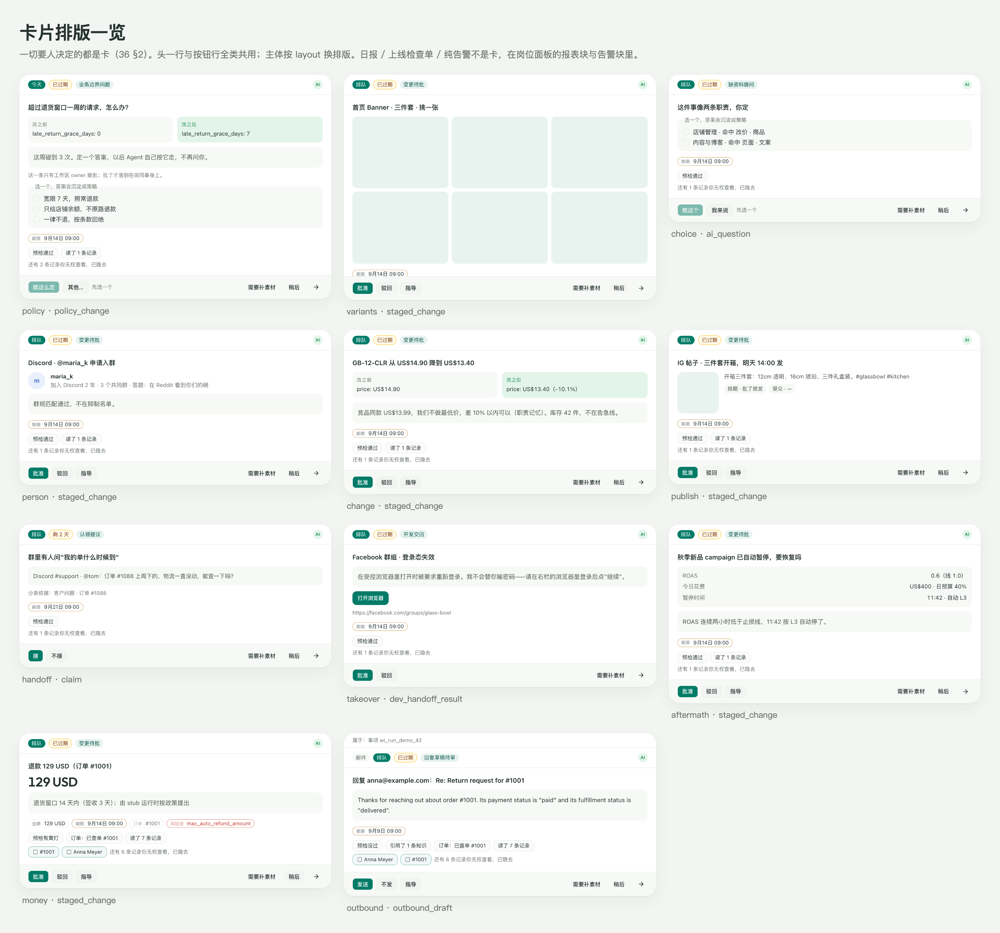
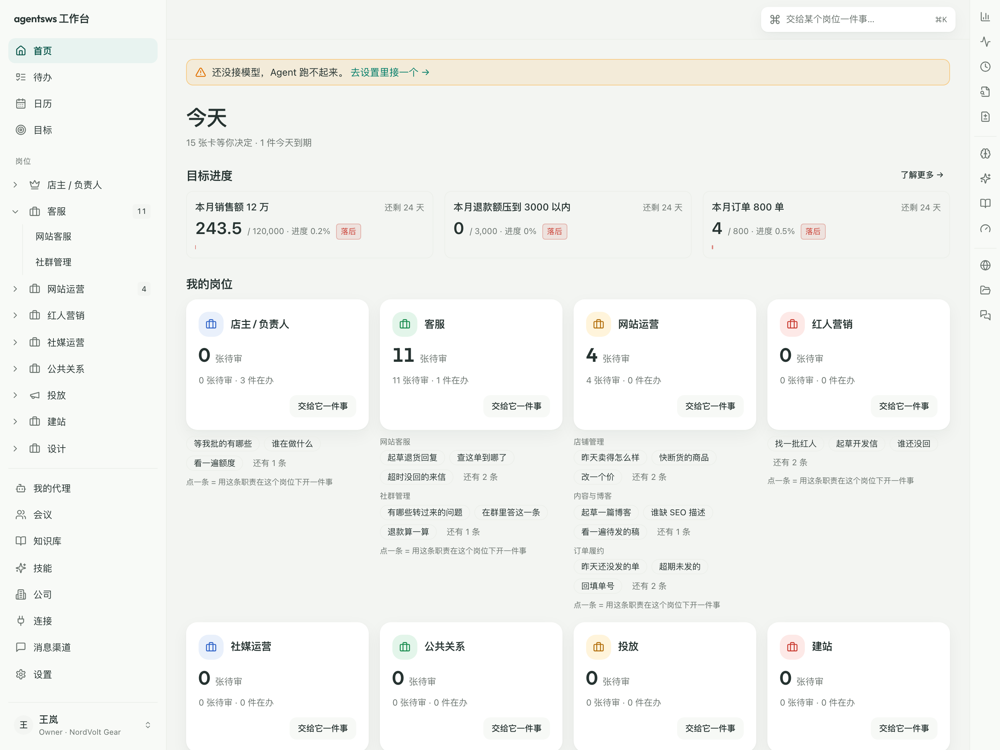
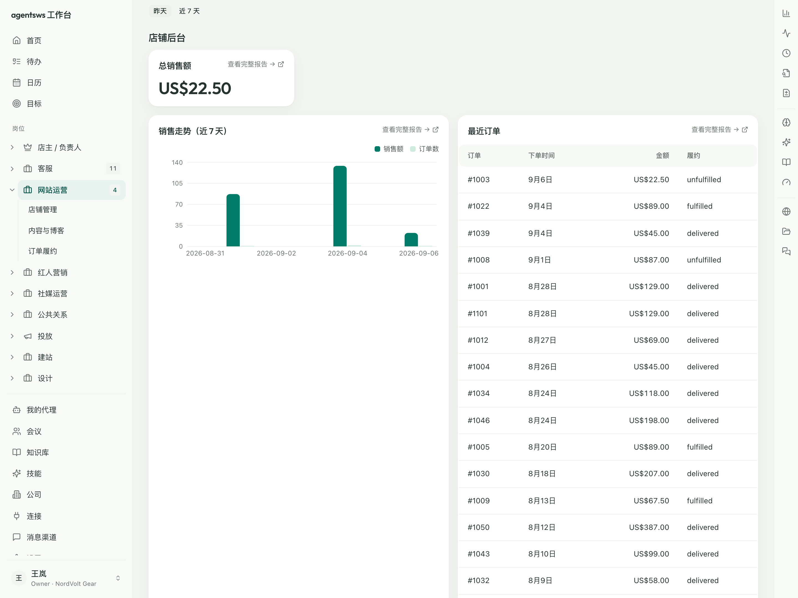
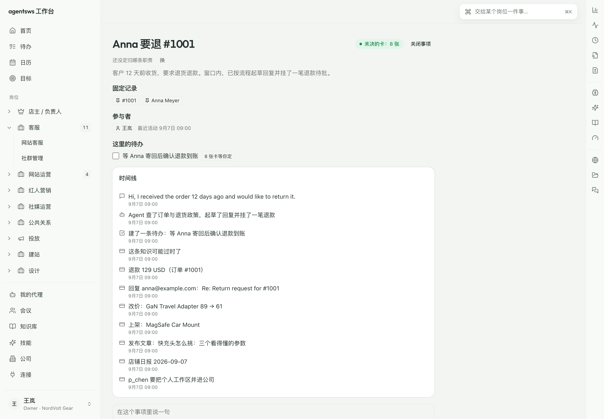
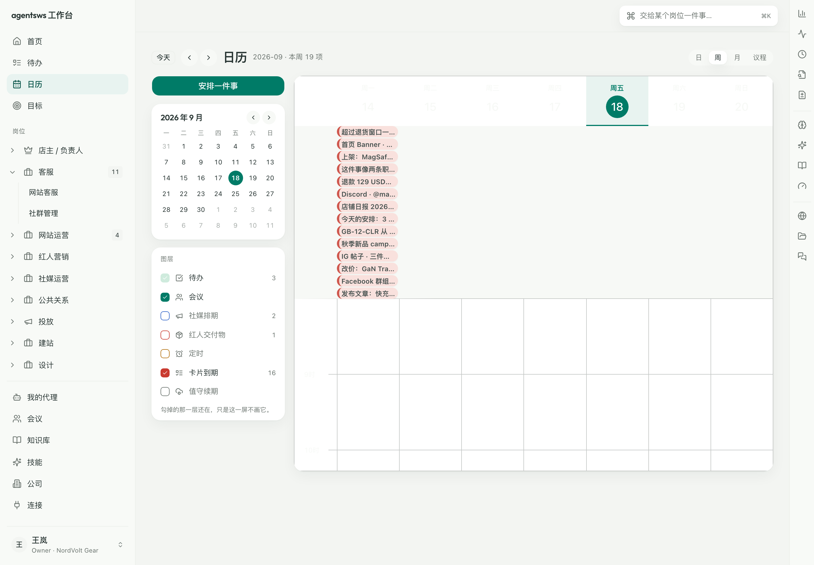
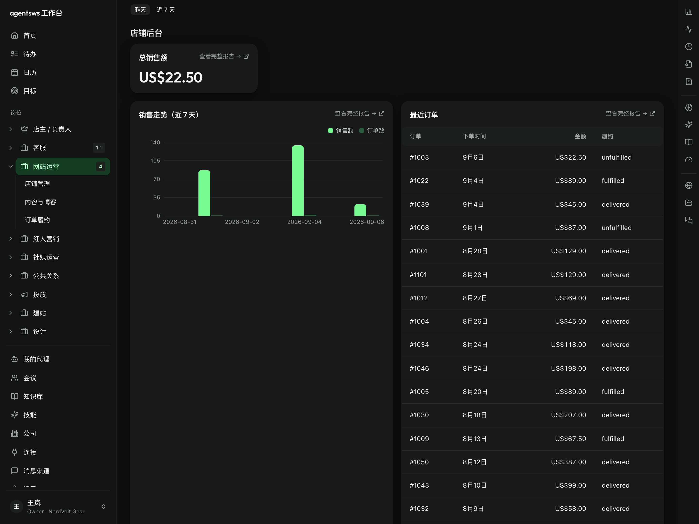

# 工作台交互原则与 UI 技术选型 v1

| | |
|---|---|
| 日期 | 2026-09-09 |
| 起因 | Luoye 否掉三个低保真方向；提出：直接用 Vercel 那套开源方案；数据面板不塞首页、按岗位分；学 KefuAgent 的卡片思路——一切需要人决策的（非即时聊天）都归到卡片、尽量给选择而不是开放式问答、保留对话入口 |
| 覆盖 | 06 §1 首页四区（改：首页 = 卡片收件箱 + 各岗位核心数据条，详细面板归岗位）、29 §3 首页装配（同）、34 §5 UI 技术栈占位 |
| 修订 | 09-09 二稿：Luoye 否掉"首页只是收件箱"——首页要放每个岗位的几个核心数据（默认按岗位给、用户可换、可选昨天 / 近 7 天），"了解更多"跳到岗位的详细面板（店铺后台 / GA4 / Search Console） |
| 修订 | 09-18 三稿（WP96）：视觉 token 定案（§1.1）；卡型表按 kind 改成**按排版分的十一种**（§2.2），并明写"日报 / 上线检查单 / 纯告警不是卡"（§2.2b）；首页与岗位面板按设计画布重排（§3） |
| 原则 | ① 工作找人，不是人找工作 ② 人只做选择题，开放式输入是例外入口 ③ 首页只放"一眼看完"的核心数字，详细面板跟着岗位走 ④ 卡片定义是数据，六端同一份 ⑤ **只有要人决定的才是卡** |

## 1. UI 技术选型（定案建议）

**"Vercel 那套开源方案"就是 shadcn/ui**（作者在 Vercel，v0 生成的也是它），底下是 Radix 无障碍原语 + Tailwind。**KefuAgent 已经在用同一套**（`components.json`：shadcn `radix-nova` 风格、neutral 基色、Tailwind v4、lucide 图标、recharts 图表），所以这不是新选择，是把两个产品对齐——33 §融合里"共享包"这一条，前端也能共享了。

| 层 | 选型 | 说明 |
|---|---|---|
| 框架 | React 19 + Vite + react-router | 不用 Next.js：工作台是本地服务的静态页（Electron 内 / 浏览器），无 SSR、无 RSC 需求；Hono 直接托管 `dist/`。KefuAgent 用 Next 是因为它是公网 SaaS |
| 组件 | shadcn/ui（`radix-nova`，base color `neutral`）+ Radix | 与 KefuAgent 同风格同基色，组件源码复制进仓库、可改 |
| 样式 | Tailwind v4，CSS variables 主题 | 深浅色两套 token；**v1 不定品牌强调色**，用 shadcn neutral 默认；强调色等品牌定了改一个变量 |
| 图标 / 图表 | lucide-react / recharts（shadcn chart 封装） | 与 KefuAgent 同 |
| 数据 | TanStack Query + TanStack Table | 查询以本人身份在服务端执行（29 §2），前端只缓存 |
| 字体 | 系统字体栈 + `Noto Sans SC` 本地回退 | 开源版离线优先，不从 CDN 拉字体 |
| 表单 | react-hook-form + zod | 敏感字段用原生表单直填（13 §4.3），不经模型 |
| 动效 | motion（按需） | 卡片进出、抽屉；不做装饰性动画 |

### 1.1 视觉 token（WP96，09-18 设计画布定稿）

v1 说的"不定品牌强调色、用 shadcn neutral 默认"到 09-18 收口了：Luoye 在设计画布上
定了一整套。**改这一段就换整套皮**——`apps/workstation/src/index.css` 的 `--ws-*`
是唯一真源，shadcn 的 `--background` / `--card` / `--border` / `--primary` 直接指到
它上面，所有既有组件不改一行跟着换。

| token | 浅色 | 深色 | 用在哪 |
|---|---|---|---|
| `--ws-paper` | `#F3F5F2` | `#0E100F` | 页面底 |
| `--ws-card` | `#FFFFFF` | `#171A18` | 卡面 |
| `--ws-line` | `#ECEFEA` | `#242825` | 分隔线 |
| `--ws-ink` | `#263331` | `#F1F4F0` | 标题与正文 |
| `--ws-muted-fg` | `#6B746F` | `#98A29B` | 次要文字 |
| `--ws-brand` | `#007B67` | `#76FB91` | 主按钮、选中、强调 |
| `--ws-brand-ink` | `#045246` | `#B9FFC9` | 品牌色上的深字 |
| `--ws-tint` | `#E8F3F0` | `#173C24` | 品牌色的浅底 |
| `--ws-good` / `-bg` | `#158A4B` / `#E3F5EA` | `#76FB91` / `#173C24` | 好、通过、涨 |
| `--ws-warn` / `-bg` | `#B26E0B` / `#FFF4DB` | `#F5C451` / `#3A2E10` | 注意、等待 |
| `--ws-bad` / `-bg` | `#C93B30` / `#FDE9E7` | `#FF7A6B` / `#3D1D19` | 坏、驳回、跌 |
| `--ws-info` / `-bg` | `#2F63C8` / `#E9F0FB` | `#8BB8FF` / `#1A2436` | 中性信息 |

三条形状上的规矩（`.ws-card` / `.ws-card-selected` 两个 class 就是它们）：

- **卡**：圆角 16、**无边框**、两层浅阴影
  `0 1px 2px rgba(20,40,30,.04), 0 8px 24px rgba(20,40,30,.05)`；
- **选中态**：`0 0 0 1px rgba(0,123,103,.32), 0 0 12px 2px rgba(0,123,103,.14)`
  加悬浮阴影再抬 `translateY(-3px)`。它是**一整块真渐变光晕**，不是"细描边再描一圈"
  的分层——加了边框就会在光晕里看见一条硬线；
- **深色照 Linear 的克制版**：霓虹绿 `#76FB91` **只**用于强调与数据高亮，不铺大面积。

字体：标题与大数字用 **Outfit**（`@fontsource/outfit`，只引 500 / 600 / 700 三档，
**本地打包不从 CDN 拉**——这一条与上面那张表同等重要，开源版离线可用），正文中文
照旧走系统栈 + `Noto Sans SC` 回退。

图表：**不引 `@tremor/react` 运行时依赖**（它带自己的 Tailwind preset 与一整套颜色，
会和 shadcn 的 token 打架）。柱状图走 shadcn chart（recharts），火花线自己画一条内联
SVG，进度环 / 进度条从 **Tremor Raw 抄成本地组件**（`components/ui/tremor/`，
出处与 Apache-2.0 许可写在那个目录的 README 里）。

**不选**：Geist UI（Vercel 早期 React 库，半停维护）、Magic UI / Aceternity / "Beautiful"系列（都是营销页装饰件的 shadcn 扩展注册表，工作工具用不上；KefuAgent 注册了 magicui 等注册表但工作面基本没用）、Ant Design / MUI（视觉与 KefuAgent 不一致，且不便共享）。

## 2. 卡片：一切需要人决策的都是卡片

### 2.1 从 KefuAgent 借什么

KefuAgent 的 `DeckCard`（`src/components/deck/deck-types.ts`，六端冻结面）已经把这件事做对了，我们**沿用其结构与动作矩阵**，只把"卡型"换成我们审批项契约（14）的 14 种 `ApprovalKind`：

- **卡 = 审批项的投影**。`ApprovalItem` 已有 `kind / title / summary / evidence / dedupe_key / automation / risk`，卡片只加展示层字段，不另建对象。**去重键 = 只问一次**，这条已经在 14 §4 里。
- **动作矩阵只有五个**：`approve`（对）/ `reject`（不对）/ `instruct`（指导）/ `snooze`（稍后）/ `open`（转详情页）。每张卡由服务端决定 `available_actions`；快捷行**最多 3 个按钮**（KefuAgent FR-015）。
- **选择题卡**：`policy_question` 类卡带 `options[]`，`approve` 必须带 `selected_option_id`，裸 approve 服务端拒（`OPTION_REQUIRED`）。业务边界"不预收集，AI 第一次遇到时以卡片选择题问一次，答案沉淀为策略"——对应我们 24 的 lesson → 次日提案，与 `policy_change` 审批项。
- **指导（instruct）不是聊天**：抽屉里先选作用域 `single_reply | similar_cases | global_rule`，再一句话；作用域决定它落到哪里（本条回复 / 技能 overlay 提案 / 职责策略变更审批项）。
- **证据芯片**：金额、期限、承诺、风险词、订单号（`highlights`）+ 出处（provenance `seen`、引用的事实卡）。数字不经模型手（29 原则 ③）。

### 2.2 卡的十一种排版（WP96，09-18 设计画布《卡片排版一览》）

v1 那张"8 种卡型"表按 **kind** 分，于是 `staged_change` 一格里装着退款、改价、上架、
挑变体、止损后恢复——它们在卡面上要回答的问题完全不同。09-18 改成按**人看这张卡时
要回答的问题**分，十一种：

| # | layout | 主体长什么样 | 谁走它 |
|---|---|---|---|
| ① | `outbound` | 正文整段 + 引用的事实芯片 | `outbound_draft`；`review_reply` / `review_invite` / `kol_outreach` |
| ② | `change` | before / after 双格 + 一句依据 | 改价 / 改预算 / 改出价 / 调库存 / 改群规 / 改资料；`knowledge_update` |
| ③ | `publish` | 左预览右说明，**排期时间与受众数必现** | 上架 / 发帖 / 群发 / 新闻稿分发 / 主题发布 / 上线 / 邮件模板启用 |
| ④ | `money` | 一个大金额 + 额度与依据的键值对 | 退款 / 补发 / 折扣码 / 促销 / 合作预算 / 佣金码 |
| ⑤ | `choice` | 单选列表，**不猜** | `ai_question` / `join_mapping` / `home_suggestion` / `daily_plan` / `review` |
| ⑥ | `variants` | N 张缩略图，人点一张 | `design_variant` |
| ⑦ | `aftermath` | 判据键值对 +「恢复 / 先停着」 | `pause_ad` / `community_moderation`（系统已经做了，问要不要改回来） |
| ⑧ | `person` | 头像 + 资料摘要 + 规则匹配 | `membership` / `kol_campaign` / `community_membership` |
| ⑨ | `handoff` | 原话 + 分类依据 + 认领 | `claim` / `mention_triage` |
| ⑩ | `takeover` | 一句发生了什么 + 打开浏览器（**Agent 不重试**） | `dev_handoff_result` |
| ⑪ | `policy` | 配置 diff，只有 owner 能批 | `policy_change` / `skill_*` / 应用装卸 / 上游升级 / 定时任务 |

三条是**全类共用**的，不在这十一种里：

- **通用头**：岗位 · 类 胶囊 → 等待时长 → 提案人头像（头像只按 `proposer.kind` 出字，
  一个 id 都不印）；
- **通用页脚**：≤ 3 个快捷决定 + 安静区，右下角一个 **→ 圆钮**——**没按钮的卡也有它**。
  它不是第四个动作，是出口：点它离开队列，进这件事的详情 / 工作线程；
- **有选项就一定出单选列表**，哪怕主体是 ⑪ 的配置 diff（`policy_change` 正是这种），
  否则 approve 永远点不亮（§2.1 裸 approve 服务端会拒）。

落代码：`DeckCard` 上加一个 `layout` 字段，由**投影层**算出来
（`@agentsws/deck` 的 `layout.ts`，`DeckKind` 一张表、`ChangeKind` 一张表，
两张都是 `Record<…, DeckLayout>`——少一个成员编译期就红）。六端拿的是同一张卡，
没有哪一端自己 `switch (kind)`。



### 2.2b 这些**不是**卡（09-18）

只有要人**决定**的才是卡。下面这三样一个决定都不要人做，所以它们离开卡片队列：

| 原来 | 现在 | 为什么 |
|---|---|---|
| `daily_report`（WP63 店铺日报） | 岗位面板的**报表块** | 看完即过，没有要批的东西 |
| `launch_check`（WP77 上线检查单） | 岗位面板的**报表块** | 只读巡检，它什么都不改 |
| `system_alert`（像素异常 / 库存告急 / 负面预警 / 超期未发） | 通知 + 面板**告警块** | 它要的是被看见，不是被批准 |

它们**引出的**决定照旧出卡：恢复投放（⑦）、补货（②）、回应舆情（①）。
账本一个字没改——14 的老规矩还在（Agent 主动做的每件事都进同一条账），变的只是
投影到界面的那一步（`@agentsws/deck` 的 `isQueueCard`）。

### 2.3 卡片对象（`DeckCard`，加到契约 #15）

```ts
type DeckCard = {
  id: ApprovalItemId; kind: ApprovalKind | 'system_alert' | 'digest'
  status: ApprovalState; priority_band: 'P0' | 'P1' | 'P2' | 'P3'   // 由 risk_class + 期限 + 14 §8 排序算出
  risk_class: RiskClass; title: string; summary: string
  position_id: PositionId; role_id: RoleId                            // 卡属于哪个岗位（§3）
  customer_label?: string; channel?: 'email' | 'chat' | 'system'
  highlights: { type: 'amount' | 'deadline' | 'commitment' | 'risk_term' | 'order_ref'; text: string }[]
  evidence_chips: { label_key: string; ref?: ObjectRef }[]           // i18n key，不出裸枚举
  available_actions: ('approve' | 'reject' | 'instruct' | 'snooze' | 'open')[]
  action_labels?: Partial<Record<Action, string>>                    // 服务端给动词（"发送"而不是"批准"）
  options?: { id: string; label: string }[]                          // 选择题卡
  detail: unknown                                                    // 按 kind 的详情 payload（草稿正文、diff、额度……）
  dedupe_key: string; expires_at?: Iso8601; snoozed_until?: Iso8601; snooze_count: number
  version: number                                                    // 乐观并发：decide 带 version
}
```

`decide` 走 14 的 `POST /v1/approvals/{id}/decide`，带 `decision_token`、`version`、`selected_option_id?`、`instruction?: { scope, text }`。**动作不经模型**（29 §5）。

## 3. 布局：首页 = 收件箱 + 核心数据条；详细面板跟着岗位走

```
左栏                        主区
──────                      ─────────────────────────────────
首页                         ① 今日卡片队列（跨岗位合并）+ 告警 + "预计 X 分钟"
                             ② 每个岗位一条"核心数据条"：3–4 个数字块（值 / 环比 / 迷你走势），
                                右上角 昨天 | 近 7 天 切换，"了解更多 →" 跳该岗位的面板
                             ③ 每日摘要（一张）
岗位
  · 独立站售后客服            ← 每个岗位一页：三个 Tab
  · 独立站运营                    卡片（只这个岗位的队列）
  · 投放-Meta                     面板（店铺后台 / GA4 / Search Console / 广告后台……各一块，29 的积木）
知识库                          记录（档案：过往对话 / 变更 / 决定）
连接与设置
```

- **首页核心数据条**（对应 06 §1 的 `focus` 区，形态定死为"数字块"）：每岗位默认 3–4 个（写在 27 职责模板的 `home_blocks`，placement=`focus`、component=`stat_tile`），用户可换、可增减、上限 6；时间范围是用户设置（默认昨天 vs 前一天；可选近 7 天 vs 前 7 天），跟随岗位记忆。数字块只显示：值、环比箭头、迷你走势线（参考 Shopify 后台的四个块）。**不放图表、不放表格**，那些在岗位面板。
- **两档时间范围到底指哪段（09-11 WP49 修正）**：**昨天** = 工作区时区的昨天 0 点到今天 0 点，对比期是前天；**近 7 天** = 6 天前 0 点到**现在**——**包含今天**（一共 7 个自然日，今天是不完整的那天），对比期是 7 天前的同一段（截到同一时刻，长度与本期相等——Luoye 09-11 定，不然早上看环比天生偏低）。原来「近 7 天」是"今天 0 点往前数 7 天"，今天被排在窗外，于是今天刚下的订单明明已经拉回来了、面板上还是 0（1d 真店验收撞上的）。用户嘴里的"近 7 天"本来就包含今天。迷你走势与走势图始终 7 格，跟本期对齐（昨天档最后一格是昨天，近 7 天档最后一格是今天到现在）；**横轴日期也按工作区时区写**，不按 UTC。另：**「最近订单」不受这个开关影响**——它就是按下单时间倒序的最新 20 条；「超期未发」同理（那是当下的积压，不是某段时间发生的事）。
- **示例默认值**：独立站运营 = 总销售额、订单数、退款额、转化率（店铺后台）；独立站售后客服 = 待回复、24h 内回复率、退款申请数、满意度；投放-Meta = 花费、ROAS、CPA、点击率（广告后台）。
- **岗位页 = 该岗位的世界**：卡片 / 面板 / 记录。面板 Tab 按数据源分块：店铺后台（Shopify 那种销售明细与走势）、GA4（活跃用户、事件、实时）、Search Console（查询、落地页），块内"查看完整报告 →"外链到对应后台。面板积木走 29 的注册表 + 命名查询；数据源没接（连接未建）时显示"去连接"卡而不是空图。
- **数据从哪来（WP46）**：接了店铺连接之后，「店铺后台」那一块的数与首页那几个数字块
  来自**真实订单**——服务进程经连接器跑 `shopify_admin.list_orders`（近 30 天）与
  `get_shop`（币种与日界线），**默认 5 分钟刷新一轮**（`AGENTSWS_LIVE_DATA_REFRESH_SECONDS`
  可调；首屏读之前会先补一轮，不用干等定时器）。每轮现签一张只读令牌、用完即吊销。
- **拉回来的订单只在内存里**：不落库、不进事件 payload、不进日志（事件只有条数、页数、
  耗时与失败原因码）。进程一关这份缓存就没了；上游拉失败就留着上一份旧的，
  断开连接则当场清空、界面变回「去连接」。
- **"了解更多"链路**：首页数字块 → 岗位面板对应块 → 外部后台完整报告。三层，越往下越细。
- **左栏那一项「日历」是一个日历、多图层**（WP74，见 37 §2.5）：待办 / 会议 / 社媒排期 /
  红人交付物 / 定时 / 卡片到期 / 值守续期七层各一个勾，日 / 周 / 月 / 议程四个视图，
  壳用 Schedule-X（MIT，贴 shadcn 的 token，深浅色都跟）。**不做"待办日历 / 社媒日历"
  几个并排的日历**——一个人一天只有一条时间轴，分开之后"周四晚上堆了多少事"就没人答得出来。
  岗位页 / 职责页进日历带 `?layers=`，默认只开相关的那几层；**首页不加日历**（54 §4：首页只有岗位）。
  WP96 只换皮**不换壳**：左栏是「安排一件事」主按钮 + 小月历 + 图层列（颜色方块就是
  勾选框，带数量与「只看这个岗位」），顶栏是 今天 / 翻页 / 范围与统计 / 四选一的视图分段，
  周视图从 07–23 收到 **08–20**，今天那一列淡绿头 + 品牌色现在线，点事件出的小卡
  与卡片队列是同一套语言（状态胶囊 + 一主一次两个按钮 + → 圆钮）。
- **首页的排法（WP96，09-18 画布《首页 · 新风格》）**：上面是一句开头（大标题 +
  「今天还剩多少事」）与**一排岗位卡**（图标徽 + 待审大数字 + 一句状态 + 持有人 +
  「交给它一件事」——54：岗位是任务主入口，所以最显眼的是那个把活儿交出去的按钮）；
  下半屏分两栏：**左 2fr 是"今天要你决定的"**（告警块 / 报表块 / 一副牌 / 复盘），
  **右 1fr 是"今天的数"与"今天"**（行式数字 + 火花线、时间轴、到期清单、正在进行、待认领）。
  段落一块没少，只是换了位置与皮。
  岗位面板第一屏同理：**数字块单排四个在最上面**（回答"现在怎么样"），
  图与表在下面两列（回答"为什么"）。走势块**两条序列就画双色柱**（"本周 vs 上周同时"），
  一条或三条以上还是折线——按数据形状挑图形，不按块名挑。

  
  
  
  
  

- **对话入口保留三处，都不是全局聊天框**：① 卡片里的"指导"抽屉（有作用域）；② 卡片 / 记录里的"问 AI"（单轮、只你可见、不发给客户）；③ ⌘K 命令面板：搜索、跳转、"首页给我加一个数字块 / 岗位面板加一张卡"（29 §4 对话定制）。**不做全局聊天框**——KefuAgent 已经把 `/copilot` 废掉，教训直接拿来。

## 4. 与现有文档的差异（本文优先）

| 文档 | 原来 | 现在 |
|---|---|---|
| 06 §1.2 / 29 §3 | 首页四区 queue / alerts / focus / digest | 四区保留；`focus` 形态定死为"每岗位一条核心数据条（stat_tile）"，带时间范围切换与"了解更多" |
| 06 §5.5 | 首页"今日关注"默认 6 张对话定制 | 首页定制只能加数字块（上限 6 / 岗位）；图表类定制卡落在岗位面板 |
| 29 §1 `Block.placement` | 五种 | 不变；`focus` 块的 component 限 `stat_tile`，query 参数带 `range: yesterday \| last_7d` |
| 34 §5 | UI 技术栈待定 | 本文 §1 |
| 14 | 审批项只有 API 形态 | 加 `DeckCard` 投影与五动作矩阵、`selected_option_id`、`instruction.scope` |

## 5. 对 WP15 的完成标准（替换 35 §5 的占位）

1. `apps/workstation`：Vite + React 19 + shadcn/ui（radix-nova / neutral）+ Tailwind v4；`pnpm --filter workstation dev` 起在 `/v1` 同源；Hono 托管构建产物
2. 首页：今日卡片队列（跨岗位合并，按 `priority_band`）、告警、摘要卡、"预计 X 分钟"；**每岗位一条核心数据条**（默认 3–4 个 stat_tile，昨天 / 近 7 天切换，用户可换可增减，"了解更多"跳岗位面板）；首页无图表无表格
3. 岗位页三 Tab：卡片 / 面板（按数据源分块：店铺后台、GA4、Search Console；≥ 3 种积木：stat_tile、table、chart_line；未连接数据源显示"去连接"）/ 记录
4. 卡片组件：§2.2 的 8 种 + 通用卡；五动作矩阵；快捷行 ≤ 3；选择题卡裸 approve 被拒；指导抽屉带作用域；证据芯片带出处
5. 对话入口：指导抽屉、问 AI 面板、⌘K（搜索 + 跳转 + 定制卡提案）；**无全局聊天框**（测试断言）
6. 深浅色；中文为主、英文 i18n 骨架；键盘可达（Radix 自带）
7. 用模拟回路的世界当后端（`apps/server` + `packs/dtc-3c-3p`）：打开收件箱能看到"退货窗口内"场景产生的回复草稿卡与退款变更卡，点"发送 / 批准"走 14 decide，事件日志里**没有任何模型调用**
8. 卡片组件与 `DeckCard` 类型放在 `packages/deck`，为 1c 与 KefuAgent 共享做准备（33）

## 6. 自主决定（待 Luoye 审）

- A1 不用 Next.js，用 Vite（理由见 §1）
- A2 v1 不定品牌强调色，用 shadcn neutral；品牌定了改变量
- A3（09-09 二稿，按 Luoye 意见改）首页保留核心数据条：每岗位 3–4 个数字块、昨天 / 近 7 天切换、用户可换；图表与表格只在岗位面板
- A4 不做全局聊天框，对话入口只留三处
- A5 卡型先做 8 种，其余走通用卡
- A6 卡片包命名 `packages/deck`（沿 KefuAgent 的 deck 叫法，便于共享）

## 7. 解释性文字放哪（WP43 ②，09-10 加）

Luoye 看完各页截图给的第二条：**"各页面解释性文字太多，能藏的放进 tooltip"**。
之前每个输入框底下一行灰字、每张卡里一段说明、每页顶上三句话，加起来比要用户
填的东西还多——工作工具不是说明书。规则收成三档，写在这里当以后的判据：

| 档 | 放哪 | 什么算这一档 |
|---|---|---|
| **可见** | 就在页面上 | ① **安全承诺**（"不经 AI、不进日志"、"密码只输在对方网站上"、"私有待办只有你自己看得到"）——用户凭它决定要不要把密钥贴进来，藏了就是失职；统一成 `<SafetyNote>`：**一行 + 盾牌**，不许铺成一段。② **错误与状态**（连不上、已提交审批、已存过一把 key、预算冻结、抓价来源与日期）。③ **空态**（"还什么都没连，下面挑一个开始"）——空页面上那句话就是唯一的引导。 |
| **tooltip** | `<Hint>`：14px 的问号，hover / focus 才出 | "为什么"、"怎么来的"、"填什么格式"、"这条规则管到哪"。典型：字段说明（接口地址长什么样）、卡片里的规则（改职责要走审批）、列表项的来龙去脉（这条建议是你哪句话学来的、当初为什么另建一条）。 |
| **折叠区** | `<details>` / 一个"展开"按钮 | 整段的步骤与清单：provider 卡的"要准备什么"（≤ 5 步 + 外链）、"高级"里的环境变量表。点开才看，不占卡面。 |

配套的三条：

1. **每页最多一句副标题**。第二句要么并进副标题，要么进问号。页头的安全承诺
   如果在真正要用的地方（那张原生表单）已经写着，页头就不再重复一遍——
   `connections.subtitle` 就是这么砍掉后半句的。
2. **`<Hint>` 的文案同时写进 `aria-label` 与 `data-hint`**。读屏用户拿得到，
   测试也断言得了（jsdom 里 Radix 的 tooltip 打不开）。它自带 `TooltipProvider`，
   页面单独渲染时也能用。
3. **i18n 新键一律 `*.hint` 后缀**，中英两份同步——以后要审"我们到底藏了多少话"，
   grep 一次就够。

同一批改动里左栏每条菜单加了 lucide 图标（16px，未选中 `text-muted-foreground`，
选中态跟文字同色；岗位按 `role_id` 挑：客服 Headset、运营 Store、投放 Megaphone、
所有者 Crown，认不出的落 Briefcase）。截图：`docs/assets/workstation/polish-sidebar.png`、
`polish-settings.png`、`polish-connections.png`。

## 8. 第三方品牌图标（WP45，09-11 加）

Luoye 看连接页截图给的第三条：**"各平台卡片都是同一个插头图标，不好看"**——六张卡
戴同一顶帽子，用户得逐张读标题才知道哪张是 Shopify 哪张是 Gmail。图标在这里不是装饰，
是**认路的第一眼**。改法与以后加新家的判据：

**一个组件**：`apps/workstation/src/components/brand-icons.tsx` 的
`<BrandIcon provider={id} size={20} />`。`id` 就是连接目录的 `service`
（`apps/server/src/catalog.ts`）或模型卡的 `kind`（`ModelProviderKind`），
认不出的**落 lucide 的 `Plug`**——目录里加了一家却忘了配图标，界面不会碎，
但 `test/brand-icons.test.tsx` 会当场红（那条用例是当场去读 `catalog.ts` 的，
不是抄一份 id 清单在测试里）。

**来源与许可**（WP45 原文，**WP48 已改，见本节末尾**）：路径数据一律抄自
[Simple Icons](https://simpleicons.org)（**CC0-1.0**，v16.30.0），每条在文件里注明
slug、品牌色（Simple Icons 的 `hex`）与抄写日期。不引 `simple-icons` 这个包——为六个
图标拉三千多个进依赖不划算，抄六条 path 进来反而看得见改了没改。

**商标三条**（这才是重点，改动之前先过这三条）：

1. **只用来标识它自己**。图标只出现在指代那家服务的地方（连接卡标题、已连接行、
   模型卡），不拿去当插画、背景、按钮底纹，也不用来暗示对方跟我们有合作或背书。
2. **原样，不改**。不改色、不描边、不加阴影渐变、不拉伸变形、不裁一半、不套进
   我们自己的形状里。尺寸只有 20px（卡标题）与 16px（列表行）两档。
3. **图标不承担信息**。一律 `aria-hidden`，旁边永远有一行品牌文字（卡标题 /
   行标题）——读屏念到的是那行字；把图标去掉，页面的意思一个字不少。

**配色与深色模式**：彩色品牌图标的 `fill` 写死品牌色 hex，深浅色主题下都是那个色
（品牌色不该跟着我们的主题变）；**单色的**（首字母徽标、通用邮箱用的 lucide `Mail`）
一律 `currentColor`，跟着文字走，深色模式下自动变浅。

**拿不到 CC0 图标的怎么办**：用**该品牌首字母的圆形单色徽标**（`currentColor`），
不去别处扒一个来源不明的标志。眼下有一个——**Simple Icons 里没有 OpenAI**
（品牌方要求下架），而「OpenAI 兼容」那张模型卡说的本来也是"任何 OpenAI 兼容网关"
（Moonshot / 通义 / 智谱 / 本地 Ollama 都从这张卡进来），不是 OpenAI 这家公司，
所以一个中性的 `O` 徽标比挂 OpenAI 的标志更准确。

**「任意邮箱（IMAP / SMTP）」不是一家公司**，给它挂任何一家邮箱的标志都是误导，
用 lucide 的 `Mail`（协议不是品牌）。

截图：`docs/assets/workstation/brand-icons.png`。

### 8.1 来源改成「各官网当前在用的那张图」（WP48，09-11 加）

Luoye 看完上面那版说：**"有几个已经不是这些平台现在在用的图标了"**。确实——
Simple Icons 那条 Gmail 还是纯红的 M（Google 2020 就换成多色的了），Search Console
也还是老的"机箱 + 放大镜"。第三方图标库总会落后于人家自己改版。

**新的顺序**（`brand-icons.tsx` 里就是这个顺序）：

1. **官网当前在用的那张图**：`apps/workstation/src/assets/brand/<provider>.png|svg`；
2. 没有就退回 **Simple Icons 的矢量图**（上面那一层，一个点都没改）；
3. 都没有落 lucide 的 `Plug`。

**构建期抓一次入库，运行时绝不联网**。这是本地优先那条原则的直接推论：用户打开连接页
时不该有一条请求偷偷发去 shopify.com / gstatic.com——那既是一次隐私泄漏（谁在什么时候
打开了哪一页），也让离线时界面缺图。品牌图标好几年才变一次，**抓一次提进仓库**正合适。
所以：

- **抓取脚本**：`scripts/fetch-brand-icons.mjs`，**手动**跑 `pnpm icons:fetch`。
  **不进 CI、不进 `pnpm build`**——仓库里那几个文件就是唯一的真源，没有任何自动更新。
- **怎么挑**：每个 provider 写一串按优先级排的官方来源。解析官网的
  `<link rel="...icon...">`（含 `apple-touch-icon`），把候选全下下来**量真实尺寸**再挑
  （矢量优先，其次最大的 PNG）；官网是登录墙、`<link>` 给的不是产品图标的（Google 那
  三家），直接指向该品牌自己的官方资源目录，并在 MANIFEST 里写明它属于哪个官网。
- **合格线**：SVG 全收，PNG **≥ 64px**，**ICO 不收**（官网给的 ICO 基本是 32px 页签图，
  放到 20px 卡片上更糊）。抓不到就**不写文件**，自动退回第 2 层，原因写进 MANIFEST 的
  `fallbacks`。眼下退回的只有 Meta（官网只给 32px ICO，business.facebook.com 的也才
  60px）——好在那个无限符号本来也没变过。
- **留痕**：同目录 `MANIFEST.json` 记每张图的 provider、来源 URL、它属于哪个官网、
  抓取日期、格式与尺寸、sha256、字节数。`test/brand-icons.test.tsx` 拿它对表：
  MANIFEST 里的每个 provider 都得有文件、字节数对得上、界面上真渲染成 ``，
  并且 `src` **绝不能以 `http` 开头**（运行时不许有外发请求）。
- **怎么更新**：`pnpm icons:fetch` → **人自己看一眼**抓回来的图对不对（是不是那家现在
  的标志、有没有抓成一张促销图）→ `git add` 提交。**不自动化这一步**：商标用错了是
  法律问题，得有人负责看过。

**商标三条一个字没变**，只是第 2 条「原样，不改」多一句：官方图有非正方的
（DeepSeek 那只鲸是 63×46），一律 `object-fit: contain` 按原比例放进方格，**不是拉满**；
圆角由外层容器决定，图本身不裁。`alt=""` + `aria-hidden` 照旧。

**这一轮抓到的**（2026-09-11）：Shopify 144×144 PNG（www.shopify.com 的
apple-touch-icon）、Gmail / GA4 / Search Console 各 128×128 PNG（Google 自己的品牌
资源目录 gstatic `branding/product`）、DeepSeek 矢量 SVG（api-docs.deepseek.com 的
`<link rel=icon>`，那只蓝鲸）；Meta 退回 Simple Icons。

截图：`docs/assets/workstation/brand-icons-official.png`。

## 9. 三栏布局与第三栏（09-16 Luoye 提出）

**修订（2026-09-18，WP93）—— 官方侧边栏对照**：dsh 0.1.6-alpha.2 的侧边栏大改全在它自己的 web 客户端（`ui-sidebar-right` 宿主 + files / terminal / documentpreview / browser 面板、回合结束文件改动逐文件审阅、Office 预览、提交计划预览、Subagent 会话、布局持久化）。我们的第三栏是自己的 React 轨、不引 `dsh-client-*`，两边骨架不互抄。18 条对照见 `docs/upstream/sidebar-compare.md`。结论：借四条机制（面板注册表、布局只存结构不存内容、启动不激活面板、内置面板与第三方走同一条注册路）；面板的形只借三个（文件改动逐文件审阅 ↔ 我们的变更卡、浏览器面板 ↔ WP82 / 92 运行中的浏览器会话、"运行中"三个字段）；**现在就缺的只有一条：文件改动逐文件审阅**（建站职责跑完一轮，人看得见"要不要发布"、看不见"改了哪几行"）——待 Luoye 定是否派；Office 预览待定（体不借，用什么转要定）；终端面板与插件管理页不借。

Luoye：Codex、Claude、dsh-harness 都是三栏，第三栏默认收起，里面有好几种（浏览器、文件…）；我们要把自己的东西（快速拉出数据面板、当前职责下运行中的任务、定时任务）融进第三栏。

**定义：第三栏 = 跟着"当前岗位 + 当前这件事"走的工具抽屉。** 左栏是"去哪儿"，中栏是"决定什么"，右栏是"看着什么决定"。

| 规矩 | 内容 |
|---|---|
| 默认 | 收起成 44px 图标轨；一次只开一个面板，宽 380（可拖到 320–520）；`]` 切换，`⌘K` 里也能开 |
| 上下文 | 面板内容永远按当前岗位 / 当前事项 / 当前卡片取：在客服卡上开"证据"看的是这单的订单与来信，在网站运营页开"数据面板"看的是店铺数字 |
| 自动弹 | 三种时候右栏自己打开：起了一个 Run（→ 运行中）、点开一张卡的"看出处"（→ 证据）、连接器要人接管浏览器（→ 浏览器）；其余全部手动 |
| 窄屏 | < 1200 变成从右侧滑出的抽屉，逻辑不变 |

七个面板（顺序 = 图标轨顺序）：

| 面板 | 放什么 | 来源 |
|---|---|---|
| **数据面板** | 当前岗位的数字块 + 一两块分块（36 §3 那套积木），范围 / 时间跟岗位页同步；可"钉住" | 我们特色 |
| **运行中** | 当前岗位 / 职责下正在跑的 Run：步骤、工具调用计数、预算（`max_tool_calls`）、可停；刚完成的三条 | 我们特色 |
| **定时任务** | 这个岗位的例行：收信轮询、日报卡、序列跟进、出站对账；下次时间、暂停 | 我们特色 |
| **证据** | 当前卡 / 事项引用的订单、来信原文、事实卡、出处（14 四段式的第二段展开） | 我们特色 |
| **浏览器** | 受控浏览器会话（53 契约 #20）：连接器 OAuth 回跳、看店铺后台页；只读 / 人接管；域名白名单 | 同行都有 |
| **文件** | 附件、导入表格、导出包、备份 | 同行都有 |
| **问 AI** | 单轮、只你可见、有边界（某张卡 / 某个事项）——已有 `ask-ai-panel`，搬进来 | 已有 |

不做：右栏里放第二个岗位的东西（不混，52）；右栏里放聊天流（对话是例外入口，不是主界面）。设计稿见 `~/Documents/Claude/Artifacts/agentsws-workstation-v1`（第三栏画板）。

### 9.1 WP71 实现：骨架 + 四个面板 + 问 AI（09-16）

**骨架**（`apps/workstation/src/components/rail/{right-rail,rail-panel,rail-state,rail-scope,panel-error}.tsx`）：44px 图标轨、一次开一个、宽 380（拖把手 320–520，键盘左右箭头也调得动）、`]` 切换（输入框里按到不算，那是在打字）、开合态与宽度记在本机、< 1200 变抽屉。左右两条栏都 `sticky` 钉在视口上——账号块在左栏最下面，而主区经常比一屏长，不钉住的话"最下面"就成了"文档的最下面"。

**图标轨上的十一个**分三组，中间那四个（记忆 / 技能 / 知识 / 额度）是 §10 那四样搬过来的：

| 组 | 面板 | WP71 |
|---|---|---|
| 上 | 数据面板 / 运行中 / 定时任务 / 证据 | 占位——点了照实说"还没做"，不给空面板。位置先占住：图标轨的位置定了就不该再挪 |
| 中 | **记忆 / 技能 / 知识 / 额度** | 做了（内容见 §10） |
| 下 | 浏览器 / 文件 / 问 AI | 前两个占位；**问 AI** 是把已有的 `ask-ai-panel` 搬进来（没有事项边界时仍是禁用态） |

**上下文规则**（`rail-scope.ts`，纯函数）：在职责页看的是那条职责，在别处（岗位页 / 事项页 / 首页 / 知识库…）看的是当前分配所属的那个岗位；面板头写着"记忆 · 店铺管理"，两层都算得出来时头上还有一个"岗位层 / 职责层"的切换——看哪一层是人的选择，不是地址的选择。

**这一版没做**：`⌘K` 里开面板、三种"自动弹"（起 Run / 看出处 / 浏览器接管）、面板钉住。

### 9.2 WP95 实现：面板改成注册表出的（09-18，§11 定案 C 的落点）

**图标轨上不再有写死的数组。** 面板一律走**两段式注册**（`components/rail/registry.ts`，形与官方 slot 同）：`registerPanelType({ id, label, icon, priority: 'extension' | 'builtin' | 'fallback', group, matches?, canOpen?, scoped? })` 声明类型（静态，图标轨与排序只读它），`registerPanelBody(id, Component)` 挂身体（一律 `lazy()`），两段各回一个 disposer；同一个 id 注册两次直接抛。**谁来开某个资源**照官方那套三段排序：`priority` 三档 → 命中的 pattern 长度 → 注册顺序，`canOpen()` 一票否决（地址空间是 `agentsws://<对象>/<id>`）。**内置的十二个（原十一个 + 新的「变更审阅」）与将来任何一个应用包的面板走的是逐字相同的两句**（`components/rail/builtin-panels.tsx`）——官方自己不许走后门，我们也不许。**布局只存结构**：本机那一份是 `{ 作用域桶: { open_panel_id, width } }`，桶按岗位 / 事项 / 职责分（`rail-layout.ts`），面板内容一个字都不存，刷新后各面板拿着作用域自己重新取；**启动不激活**——没打开的面板不下载、不挂载、不发请求。两个新面板：**运行中的浏览器**（借 #12 / #15 的形，数据是事件日志的投影 `GET /v1/runs/:id/browser`，只给域名不给整条 URL）与**变更审阅**（借 #11 的形，主题工作副本目录的 `git diff`，`GET /v1/changes/:id/files`，逐文件展开，**只看不改**）。薄适配层 `official-adapter.ts` 只定义官方 slot 的形状与映射，**不引任何 `dsh-client-*`**，官方浏览器面板不接（spike ④ CSP）。截图 `docs/assets/workstation/wp95-rail-{browser,changes}.png`。

## 10. 左栏结构与"岗位 / 职责的设置在右栏"（09-16 Luoye 定，同日改一次）

- **品牌切换器与账号 profile 在左栏最下面**（和 KOLAgents / KefuAgents 一样），顶栏只留 ⌘K、模型与积分。
- **岗位在左栏可展开**（行首 › / ˅）：展开后只列该岗位的职责；点岗位进岗位页，点职责进**职责页**（概览 / 记录）。左栏不放设置项。
- **每个岗位、每条职责各自的记忆 / 技能 / 知识 / 额度，放在第三栏（§9）的四个面板里**，内容跟着"当前岗位 / 当前职责"走（在职责页 = 那条职责；在岗位页 / 事项页 / 首页 = 当前岗位；面板头可切岗位层 / 职责层），用户可手改：记忆（本层条目列表，来源 / 谁批的 / 手动加，可改可删可"提到上一层"，提升走提议 → 批准；下面折叠"上面继承的"；"六层怎么叠"高亮本层）、技能（按六层列，本层可开关 / 加，其它层"提到本层"）、知识（适用范围 + 命中的事实卡，跳知识库筛选）、额度（职责 yml 的 caps / window / automation 表，改 = `policy_change` 审批；内置模板先"复制一份"）。
- 第三栏图标轨于是分三组：这件事的（数据面板 / 运行中 / 定时任务 / 证据）· 这个岗位或职责的（记忆 / 技能 / 知识 / 额度）· 工具（浏览器 / 文件 / 问 AI），共十一个。
- 设计稿：`~/Documents/Claude/Artifacts/agentsws-workstation-v1`（第三栏、职责页画板）。落地 → WP71（骨架 + 四个面板 + 问 AI 搬入 + 左栏）。

### 10.1 WP71 实现（09-16）

**左栏**（`components/app-shell.tsx`）：岗位行首一个展开箭头，展开后列**本人持有**的那几条职责（别人持有的那条不列——列出来只会点进一个进不去的页面，54 §2）；展开态记在本机，存的是**显式选择**（`position_id → 布尔`），没记过的按"当前岗位默认展开"算。品牌切换器与账号块（头像 / 名字 / 角色 · 公司名 → 账号与积分 / 设置 / 退出）在最下面；顶栏只剩 ⌘K 与模型、积分两个芯片（**问不到就不出**，不显示"—"或 0），深浅色与语言收进账号菜单。截图 `docs/assets/workstation/rail-expanded.png`。

**职责页** `pages/duty.tsx`（路由 `/positions/:assignment/duties/:role_id`）：面包屑「岗位 › 职责」、职责名与版本、"内置只读 / 从内置模板复制"pill、持有人数、「用这条职责开一件事」（职责入口，用**这条职责的分配**、跳过岗位内路由），tab 只有**概览 / 记录**；头部四个按钮是"把右栏打开到那一格"，不是第二个入口。它不出现在首页，只从左栏展开层或岗位页折叠层进。岗位页 tab 一个没动（卡片 / 面板 / 记录 / 记忆）。

**四个面板**（`components/rail/panels/*`）：

| 面板 | 内容 | 写口 |
|---|---|---|
| 记忆 | 本层条目（正文 + 来源 + 谁 + 日期）、折叠的"上面继承的"、一张"六层怎么叠"（本层高亮） | 改 / 删 / 手动加 = `POST`/`PATCH`/`DELETE /v1/memory` 当场写；"提到上一层" = 提议 → 批准。**能不能改由服务端的 `can_edit` 说**，界面不判第二遍（54 §3） |
| 技能 | 按六层分组，本层标出来 | 「我不用它」= exclude（只影响本人）；「提到这一层」= promote（出卡）。**不做技能编辑器**——改正文要看得见全文与 diff，380 宽里做只会做残，那件事在 `/skills` |
| 知识 | 这一层的知识域 + 范围 + 敏感级（19）、在用的事实卡数、进知识库的口子 | 只读，不做编辑器 |
| 额度 | 职责 yml 的 `caps` / `window` / `automation` | 改 = `PUT /v1/roles/:id`（org 页职责编辑那条路，不另起一条）→ `policy_change` 卡 → 界面显示"已提交审批"（14 §1）。内置模板出的是"复制一份再改"（05 §0）。岗位层没有自己的额度（权限与额度长在职责上，54 §2），那时列的是这个岗位下的职责 |

截图 `docs/assets/workstation/duty-memory.png`。

**发现的洞（未修，要 Luoye 定）**：职责模板里**没有 `skill` 与 `policy` 这两个域**（只有 `common.owner` 有），而当前分配一旦切到某条职责，`GET /v1/memory`、`GET /v1/skills`、`GET /v1/roles/:id` 三条一起 403 —— 记忆 / 技能 / 额度三个面板、技能页、职责页概览在**非 owner 的分配上全都打不开**。这是 WP69 就有的洞（岗位页那个「记忆」tab 同样），第三栏把它摆到了每一页上。界面这一侧没有绕过它（换一条有权限的分配来问，正是 31 §3.1 与 54 §2 禁的"借岗位扩权"），只是把话说明白：`panel-error.tsx` 把 403 翻成"这条职责的分配上没有 `skill.read` 这一项"。两条修法都要定：给职责模板加这两条 read scope（动 20 个 yml、要重定基线），或把这三条路由的 authz 从 workspace 读降成"本人持有这一层"。

## 11. 第三栏改建在官方侧边栏之上？（2026-09-18 Luoye 提出，方案稿）

Luoye：第三栏的技术方案要改——在官方侧边栏的基础上集成我们的功能，不然越到后面兼容性越差、积重难返，很难随官方版本一起升级。

**先摆两个事实**（出处 `docs/upstream/sidebar-compare.md`、WP93）：
1. 官方侧边栏是它 **web 客户端**的一部分：布局引擎 `ui-dockkit`（分屏树 + 标签页，不知道 dsh）→ 宿主 `ui-sidebar-right`（产品文案、`ctx.sidebarRight`、绑 session）→ 面板（files / terminal / documentpreview / browser，两段式 slot 注册：类型 + 身体，`priority` 三档）；布局按 session 存 localStorage、只存结构不存内容。
2. 客户端这一层是 dsh 变得最快、又没有稳定 seam 的地方（alpha.2 自己写"客户端 Session 多实例，API 及 slot 有变化"），而且它默认绑在 dsh 的 web 应用宿主（`connection` / `modules` / `webserver` 那几行）上，没有文档化的单独嵌入路径。

所以"改建在官方之上"有三档做法，先用一个 spike 把可行性试出来再定：

| 档 | 做法 | 收益 | 代价 / 风险 |
|---|---|---|---|
| A 整个工作台跑在 dsh web 客户端 shell 上，我们的页面全变 slot 插件 | 与官方 UI 同步升级最彻底 | 我们的界面原则（岗位 / 卡片 / 无聊天框、shadcn）与它的聊天中心骨架相反；三档部署都要起它的 web 宿主；工程量最大 |
| **B 只把第三栏换成官方宿主**：在我们的 React 工作台里嵌 `ui-dockkit` + `ui-sidebar-right`，我们的四个面板（记忆 / 技能 / 知识 / 额度）按它的 slot 注册，官方面板（浏览器、文件改动审阅、文档预览）原样挂 | 官方新面板零成本接进来；第三栏随官方升级 | 宿主能否脱离 dsh web 应用单独嵌**未知**；slot API 仍在破坏性变动期；我们的"跟着岗位 + 事项走"的上下文要塞进它的 session 概念 |
| C 保留自己的轨，但把面板注册表做成与官方 slot 同形（类型 + 身体 + priority），布局只存结构，官方面板经一层薄适配挂进来 | 骨架自主、面板可借 | 适配层要跟官方 slot API 一起改，"兼容性"仍是我们扛 |

**Spike（WP94，一周内出结论，不进产品）**：在一个独立页面里嵌官方 `ui-dockkit` + `ui-sidebar-right`，注册我们的两个面板（记忆、额度）+ 挂两个官方面板（browser、workspace-changes 文件审阅），回答五个问题：① 宿主能否不起 dsh web 应用（`connection` / `modules` / `webserver`）单独嵌进我们的 React 树；② 官方面板依赖哪些 host 服务（session、attachment、webserver 路由），我们的服务进程能不能供；③ 我们的"当前岗位 + 当前事项"上下文怎么传给 slot（它只认 session）；④ alpha.1 → alpha.2 的 slot API 差异有多大（衡量"跟着升"的真实成本）；⑤ 打包体积与 CSP（我们的壳 `default-src 'self'`）。每个问题给证据。结论出来后 Luoye 在 A / B / C 里定。

**Spike 结论（WP94，2026-09-18，报告 `docs/upstream/official-rail-spike.md`，分支 `wp/94-rail-spike` 不合）**：能嵌且真跑起来（dockkit + sidebar-right + 官方浏览器面板在我们工作台里渲染，两个面板按 slot 挂入，不起 dsh web 应用；作用域不用走 session，填岗位 `scope_id` 即可）。但四个硬事实：① 官方客户端包非 ESM、依赖声明为空（要自己当模块加载器、补十几个库）；② 五个新面板只有浏览器面板不依赖 host，文件改动审阅要常驻 dsh Session 服务，与 17 §5.1 冲突接不进来——B 档"官方面板零成本接入"不成立；③ `ui-slots` / `ui-renderer` 一版四条破坏性改动，一条正打在传作用域的接口上；④ 官方浏览器面板 iframe 直连目标 URL，与壳 `default-src 'self'` 撞死。成本（人日）：A 70–125（持续 3–8 / 版）、B 19–32（1–3 / 版）、C 10–17（0.5–2 / 版）。**建议 C**。**Luoye 定 C（2026-09-18）**：骨架自有、面板注册与布局机制按官方形做、官方面板经薄适配挂入；不放宽壳的 CSP（官方浏览器面板的 iframe 直连不接，"运行中的浏览器"用我们自己的面板画 WP82 / 92 的会话状态）。落地 WP95。

**落点（WP95，2026-09-18）**：Luoye 定 **C**，已实现——自有轨不动，面板注册表与官方 slot 同形（两段式 + `priority` 三档 + `patterns` / `canOpen`），布局只存结构且按岗位 / 事项 / 职责分桶，启动不激活，薄适配层 `official-adapter.ts` 只有形状与映射、**不引 `dsh-client-*`**（spike ① 非 ESM / ③ slot API 一版四条破坏性改动），官方浏览器面板**不接**（spike ④ 与壳 `default-src 'self'` 撞死）。同时把对照表里"现在就缺的那一条"（#11 文件改动逐文件审阅）真做了，并按 #12 / #15 画了「运行中的浏览器」。详见 §9.2 与 `docs/upstream/sidebar-compare.md` 里每条的"已做 / 未做"。

