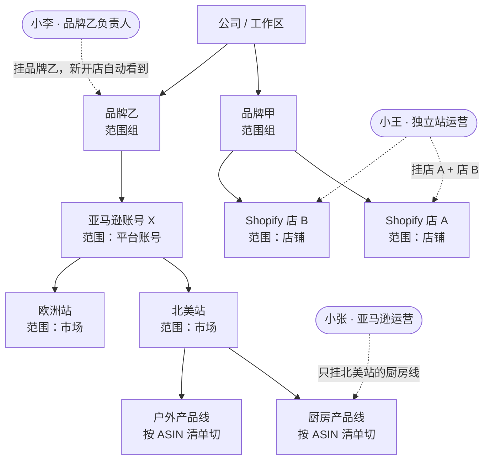

# 44 · 多品牌、多店铺与产品线的范围模型 v1（讨论稿）

| | |
|---|---|
| 状态 | 讨论稿，等 Luoye 拍板 G1–G5 |
| 起因 | 2026-09-11 Luoye：跨境公司常有多个品牌；一个亚马逊运营有时管多个店铺，有时管不同产品线——底层拆解时没考虑到 |
| 关联 | 05 §7 待定第 1 条（Range 种类够不够、多店铺公司每店一个 range 还是店铺组）、19 §3 过滤下推、20 身份与工作区、40 数据归属 |

## 0. 一句话

现在的"范围"（Range）只认四种：店铺、部门、平台账号、市场。**多店铺已经能表达，多品牌和产品线表达不了。** 建议：加一种"产品线"范围，加一层"品牌"分组，范围之间可以组合（并集），一个人一个岗位可以挂多个范围。改动集中在职责层和过滤下推，不动内核。

## 0.1 一张图

虚线是岗位挂的范围，实线是组织结构。范围为空的岗位看不到任何数据（05 §5）。

## 1. 现状：范围是什么、怎么起作用

- 一个岗位（Assignment）= 一个人 × 一个职责模板 × **若干范围**。范围写成 `{ kind, id }`，kind 只有 `store` / `department` / `account` / `market`（契约 `RangeKind`）。
- 职责模板里每条数据权限都标着 `range: assigned | workspace | own`。`assigned` 的意思是"只看你挂上的那几个范围里的数据"。**范围为空的岗位拒签 token、查询为空**（05 §5，31 §3.1）——这就是今天真店验收里"店铺后台"分块静默消失的原因。
- 数据层按 (domain, ops, range, sensitivity) 完整元组判定（19 §3 过滤下推：不是先给再脱敏，是压根不查）。

所以：**同一个人管两家店 = 一个岗位挂两个 `store` 范围**，这条今天就能做（27 的 SMB 样板就是"两个店铺 range"）。缺的是下面三种。

## 2. 三种真实情况

| 情况 | 例子 | 现在能不能 | 缺什么 |
|---|---|---|---|
| **A 多店铺** | 一个独立站运营管 3 家 Shopify 店 | 能：3 个 `store` 范围 | 界面上还没有"挑店"的向导（org 分配向导只填了范围 kind + id） |
| **B 多品牌** | 公司有品牌甲、乙、丙，每个品牌下面几家店 + 几个亚马逊账号；一个人"管品牌乙" | 不能优雅表达：只能把品牌乙下面所有店和账号一个个挂上，品牌新开一家店还得挨个岗位补 | **品牌是范围的分组**，不是新一种范围 |
| **C 产品线** | 同一个亚马逊账号里，A 运营管厨房类目，B 运营管户外类目；订单、库存、Listing、广告都按产品线切 | 不能：账号是最小范围，切不到账号内部 | **新一种范围 `product_line`**，它的成员由平台内的判据决定（Shopify 集合 / 标签 / 供应商，亚马逊 ASIN 清单 / SKU 前缀 / 品牌注册） |

B 和 C 是两个不同层次：品牌在范围**上面**（一组范围的名字），产品线在范围**里面**（一个账号 / 店铺的子集）。

## 3. 方案

### G1 品牌 = 范围组（Range Group）

- 新对象 `RangeGroup { id, name, members: RangeRef[] }`，放在工作区的组织结构里（和部门同级，20 §2）。
- 岗位挂范围时可以挂"品牌乙"这个组；**判权限时展开成成员**，岗位记录里存的仍是展开后的 `ranges`，另加 `range_groups: [id]` 记住来源。品牌新开一家店 → 把店加进组 → 所有挂了这个组的岗位在下一次 `effectiveConfig` 时自动多这家店（**要不要自动**见 G5）。
- 不加新 `RangeKind`：品牌不是一种数据切法，是一组切法的名字。这样过滤下推一行不用改。

### G2 产品线 = 新范围种类 `product_line`

- `RangeKind` 加 `product_line`。一条产品线的定义：`{ id, name, parent: RangeRef(store|account), rule }`，`rule` 是**平台内的判据**：
  - Shopify：集合 id / 商品标签 / 供应商 / 商品类型（这四个都是 Admin GraphQL 能 `query:` 直接过滤的字段）
  - 亚马逊：ASIN 清单 / SKU 前缀 / 品牌注册名（SP-API 报表能按 ASIN 过滤；订单要在本地按行项目切）
- **判定发生在两处**：
  1. 拉数据时（活数据源 / 连接器读动作）——能下推的下推（Shopify `query: tag:kitchen`），不能下推的**拉回来在本地按行项目过滤**，然后才进缓存和面板；
  2. 写动作时——改价、改 Listing、补货计划的目标对象必须落在产品线成员里，不在就是越权（`unassigned_range` 同一条路，13 的 guardrail 前置检查加一条 `target_in_range`）。
- 一个订单里混了两条产品线的商品：**两边都能看到这张订单，但金额只算自己那部分行项目**（数字块）；售后类动作（退款）按整单走，谁先认领谁处理（40 §3 撞车规则已经覆盖）。

### G3 岗位可以同时挂多种范围，取并集

- 一个人一个岗位：`ranges: [{store: A}, {store: B}, {product_line: 厨房@账号X}]`——并集。
- 同一个人**两种切法要分开的**（管品牌乙全部 + 管品牌甲的户外线），建议建**两个岗位**而不是塞一个岗位：额度、采纳率、撞车都是按岗位记的，混在一起数字就说不清。分配向导里给一句提示。

### G4 亚马逊的"账号"要再分一层"市场"

- 亚马逊一个卖家账号（`account`）下面有北美 / 欧洲 / 日本站点（`market`），今天两种范围都有，但没写清楚它们的父子关系。定：`market` 的 id 写成 `账号id:站点`（如 `amz_na:US`），`account` 范围隐含它下面全部市场。产品线的 `parent` 可以是 `account` 也可以是 `market`。
- 独立站没有这一层：一家 Shopify 店就是一个 `store`，Shopify Markets（多币种多语言）当作店的属性，不当范围。

### G5 品牌组变了，已挂的岗位要不要自动跟着变

- 建议：**自动跟**，但记一条事件 `assignment.range_expanded`，并给 owner 一张卡"品牌乙新增了店 X，这 3 个岗位自动看得到了，要不要改"（14 的审批项，L3 默认放行）。理由：品牌就是为了少一遍挨个改；但变更要留痕，这是 40 §1 数据归属的底线。

## 4. 不做什么

- 不做"品牌级角色"（品牌经理这种）：品牌经理 = 挂了品牌组的 `common.member` 或某个运营职责，职责和范围正交，不要为品牌单独发明职责。
- 不做跨工作区的品牌：一个公司一个工作区，品牌在工作区之内（20 §1）。集团多公司各开工作区，那是另一层。
- 不在 v1 做产品线的自动发现（按销量 / 类目自动分线）：先手填规则，开源后看用户怎么用。

## 5. 改动落点（估）

| 层 | 改什么 | 量 |
|---|---|---|
| 契约 | `RangeKind` + `product_line`；`RangeGroup`、`ProductLine` 两个对象；`Assignment.range_groups?`；事件 2 条 | 小 |
| 职责（roles） | 展开范围组；`unassigned_range` 判定认产品线；`target_in_range` 前置检查 | 中 |
| 连接器读 / 活数据源 | Shopify 的 `query:` 下推 + 本地行项目过滤；亚马逊待接入时同法 | 中 |
| 工作台 | 公司页：品牌组与产品线的增删；分配向导：挑店 / 挑品牌 / 挑产品线三种入口 + "两种切法建两个岗位"提示；岗位页：没挂范围时明说"还没分配范围" | 中 |
| 模拟 | 15 人 pack 加两条：品牌新开店自动扩范围；两个运营同一账号不同产品线各改各的价、互相看不到 | 小 |

## 6. 请拍板

- G1 品牌 = 范围组（不加新范围种类）
- G2 产品线 = 新范围种类，判据是平台内字段，能下推就下推、不能就本地切
- G3 一岗位多范围取并集；两种切法建两个岗位
- G4 亚马逊 账号 ⊃ 市场；独立站不分
- G5 品牌组变化自动跟、留痕、给 owner 一张卡

同意后派 WP47（契约 + roles + 向导 + 模拟）。
