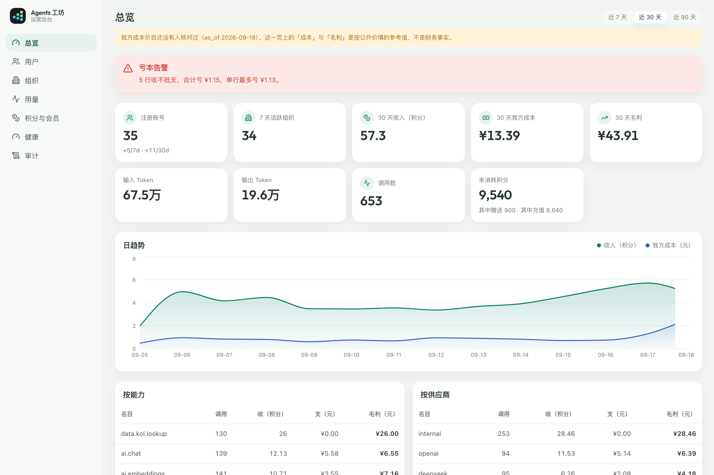
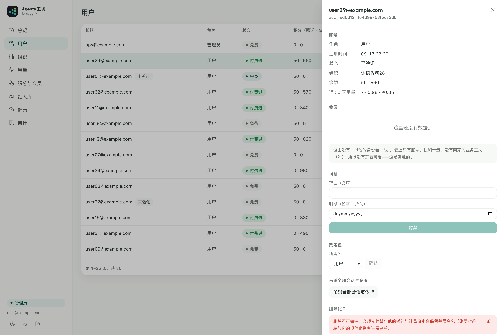
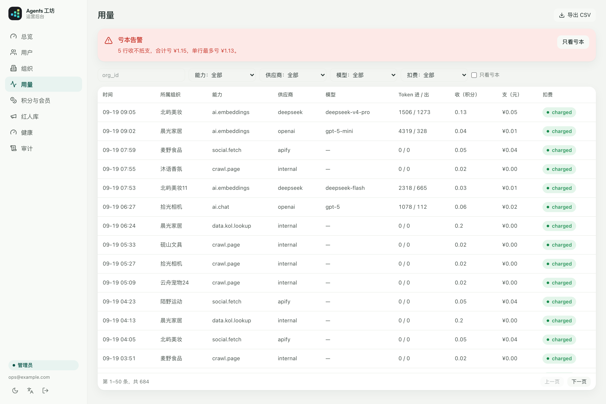
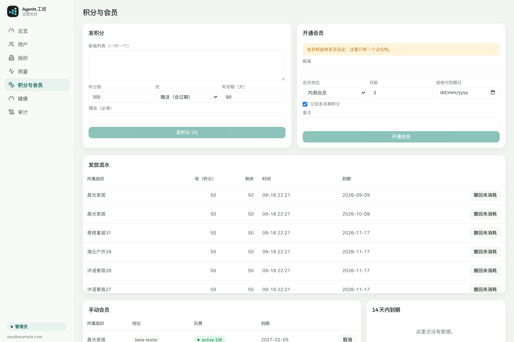

# 65 · 云端运营后台 v1（WP115）

| | |
|---|---|
| 状态 | **WP115 实现**（2026-09-18）。两个形态都跑得起来：Compose 自建（61）与 Cloudflare Workers 官方托管（64） |
| 起因 | Luoye：「后台的管理应该参考下 KOLAgents 和 KefuAgents 两个项目的后台，除了简单的用户注册管理以及移除，包括积分和会员赠送，还有各个接口调用的次数，例如 Token 使用数量，金钱消耗等等。」 |
| 关联 | 49（账号 / 服务入口 / 积分 M1–M6，1 积分 = ¥1）、52（公司 = 组织，品牌 = 工作区）、21（数据驻留：**云端没有也不该有商家的业务正文**）、36（设计语言与 `--ws-*` 令牌）、61 / 64（两个部署形态）、`apps/cloud-admin/`（界面）、`apps/cloud/src/admin/`（接口）、`packages/metering/`（成本与聚合） |

## 0. 一句话

**后台只回答三个问题：谁在用、用了多少、我们赚了还是赔了。** 它不提供、也没有能力提供第四个问题的答案——商家在自己电脑上做了什么，云上根本没有那份数据。

---

## 1. 边界（先说不做什么）

agentsws 是**本地优先**的：商家的商品、订单、客服对话、红人名单、生成的文案，全都在他自己的电脑或 NAS 上（docs/21）。云上只有六样东西：

| 云上有 | 云上没有 |
|---|---|
| 账号（一个邮箱）| 任何业务正文 |
| 组织（计费主体）| 任何附件 |
| 工作区关联令牌（只有 sha256）| 任何订单内容 |
| 钱包（两类积分的 lot）| 任何 prompt / 响应 |
| 计量事件（能力 / 数量 / 积分 / 成本）| 任何红人名字或联系方式 |
| 公共红人库（Compose 形态才开，见 §10）| 商家的工作区数据 |

**所以后台不做"模拟登录"**（"以他的身份看一眼"）。两个旧后台都有这个功能，因为它们是 SaaS——用户的数据在它们的库里。我们不是：点进去也只会看到同一份账号、同一份余额、同一份计量流水，也就是后台本来就在看的东西。做一个这样的按钮，唯一的效果是让人**以为**我们能看到他的生意。

这一条写在界面上（用户抽屉里那一句话），不只写在这里。

---

## 2. 角色、登录与守卫

### 2.1 角色是一列

`cloud_accounts.role`：`user`（默认，旧行是 NULL）/ `support`（**只读**）/ `admin`（可写）。
不新开一张表：后台是我们自己的，不存在"在这个组织里是 support、在那个组织里是 user"。

### 2.2 第一个管理员怎么来

`POST /v1/admin/bootstrap`，认的是 WP110 已有的那把运维钥匙 `AGENTSWS_CLOUD_ADMIN_TOKEN`
（没配这条路由**根本不挂**）。它做两件事：把指定邮箱提为 `admin`，**并把他现有的会话
全清掉**——提权之前签出去的凭据是以 `user` 的身份签的，留着等于给一张旧票据补了新权限。

### 2.3 之后的登录

`/admin/login`（公开，服务端渲染，没有前端构建）→ 输邮箱 → magic link →
`/admin/callback?token=…` → 验一次性 token → **看角色** → 种两张 cookie → 302 回 `/admin/`。

- 只有 `role ∈ {admin, support}` 才发后台会话。不是 staff 的邮箱：**响应一模一样，但一封信都不发**——回"这个邮箱不是管理员"等于把我们内部有哪些人一个个试出来。
- 会话 cookie 是 `__Host-agentsws_admin`：httpOnly + Secure + SameSite=Lax + Path=/ + 没有 Domain。服务端有会话表，**12 小时滑动过期、7 天绝对上限、可吊销**。
- 顺手把 `verifyLogin` 签出来的那张**云账号会话**撤掉：后台登录不该顺带给浏览器一张能调 `/v1/cloud/links` 的 Bearer token。
- **`Secure` 在 `localhost` / `127.0.0.1` 上也带**：`__Host-` 前缀要求必须有 `Secure`，而浏览器把本机当可信来源。只按 `https://` 判的后果是本机联调**永远登不进去**（cookie 被浏览器当场丢掉，页面上什么异常都看不出来，只是一直回登录页）。这一条是真踩出来的。

### 2.4 守卫四条

1. **无权一律 404，不是 403**（KOLAgents 那条）。403 等于告诉试探的人"这条路确实存在，你只是差一个角色"。404 之后，`/v1/admin/accounts` 与 `/v1/admin/nonsense` 在他那边长得一模一样。`/admin/*` 的静态壳也一样——**连 index.html 都不给**。
2. **角色每次请求现查**：刚被降级的人的旧 cookie 当场失效，不等它十二小时后自己过期。
3. **写接口 = `admin` + CSRF**。CSRF 是双提交（cookie 一份 `agentsws_admin_csrf`、请求头一份 `X-Agentsws-Csrf`）**加上** Origin 校验；库里存的是 csrf 的 sha256，三方都要对上。只做 Origin 挡不住没有 Origin 头的老浏览器；只做双提交挡不住同站点的子域写 cookie。
4. **`support` 一个写接口都调不动**，判在包装器里而不是每个 handler 里——漏判一次就是一个只读角色能封人。

写接口还认 `Idempotency-Key`（网关那道中间件，24h 内同键重放原响应）。

---

## 3. 我方成本怎么算

### 3.1 两张价目表，刻意分开

| | 文件 | 回答什么 |
|---|---|---|
| 对用户 | `packages/metering/src/pricing.json` | 这一次向用户收多少积分 |
| 我方成本 | `packages/metering/src/cost-table.json` | 这一次我们自己付出去多少钱 |

合成一张的后果是：改售价会顺手改掉历史成本，于是毛利永远是我们想要的样子。

### 3.2 三条算法纪律

- **整数微单位**（1 元 = 1_000_000 微元）。KefuAgent 曾经把成本四舍五入到分，于是 200 token 的便宜模型成本恒为 0，看板上毛利率一年都是 100%。
- **按模型名最长前缀匹配**。`gpt-5-nano` 必须先命中 `gpt-5-nano` 而不是 `gpt-5`，否则成本贵 25 倍。
- **认不出的模型落最贵档，而那一档是从表里算出来的**（折成人民币之后比 `in + out`），不是写死的常数：往表里加一个更贵的模型，兜底自动跟着涨。估贵了只让毛利显得保守，估便宜了会让一条真亏本的调用在看板上显示赚钱。
- **非 token 的按 `provider:unit`**（`apify:call` / `youtube:call` / `internal:call`）。认不出的键**回 0 并标记"不知道"，不落最贵档**——非 token 的上游各家量纲差着几个数量级，拿其中最贵的兜底只会造出一个吓人的假成本。

### 3.3 ⚠️ 需要 Luoye 核对的清单

`cost-table.json` 的 `last_verified_at` 是 **null**，`needs_review` 是 **true**。后台的页脚与
`/v1/admin/health` 都会把这件事说出来：**"这一页上的成本与毛利是按公开价填的参考值，不是财务事实。"**

要核对的：

| 条目 | 现在填的 | 为什么要核 |
|---|---|---|
| DeepSeek / OpenAI / Moonshot / 智谱的 token 单价 | 抄自 `model-gateway/src/pricing/catalog.json`（`as_of 2026-09-10`）| 那张表本身也是参考价；而且我们买的是**内部渠道价**，多半与官网标价不同 |
| `apify:call` = $0.005 | 编的量级 | **最需要核**——它是今天唯一真花现金的非 AI 上游 |
| `youtube:call` = $0 | 免费配额之内确实是 0 | 超配额之后是多少？开通计费的那天要回来填 |
| 汇率 USD 7.1 / EUR 7.7 | 与 `pricing.json` 同一张快照 | 两边必须一致，否则毛利成了汇率差的函数 |
| New API 自己的加价 | 记 0 | 如果内测期直连官方就是 0；接回自建 New API 时要确认它不额外抽成 |

### 3.4 计量事件扩了八列

49 M6 原本是"**八个字段，一列不多**"。WP115 扩到十六个，后八个**全可选**：
`provider / model / input_tokens / output_tokens / cost_micros / cost_currency / charge_status / account_id`。

为什么这不算违反 M6：这八列全是**成本会计**的量，没有一个字来自用户的 prompt、响应、附件或订单。
M6 真正要挡的是"从上游响应里 spread 一把过来"，而那道运行时断言**一个字没改**——
不在白名单里的键照样抛（`assertMeteringEvent`）。旧行这几列是 NULL，聚合时 `COALESCE(…, 0)`：
那不是"未知"，是"那时候没记"。

`charge_status` 五档：`charged` / `insufficient_credits` / `skipped`（本来就免费）/ `error` /
**`admin_exempt`**（我们自己人的调用：不向他收积分，但**成本照记**——那笔钱确实付给了上游；
聚合时整行滤掉。KefuAgent 那条：自己测试把失败率顶到天上，看板从此没人信）。

**现状**：管线今天只发出 `charged` / `skipped` / `admin_exempt` 三种。`insufficient_credits` 与
`error` 在枚举与台账筛选里，但**没有代码会写出这两种行**——余额不够与上游出错时预扣整笔释放、
不记计量事件（49 M3 的既有纪律）。这是有意保留的枚举位，不是漏实现（见 §11 未完成）。

---

## 4. 八页与口径表

侧栏顺序：**总览 → 用户 → 组织 → 用量 → 积分与会员 → 红人库 → 健康 → 审计**。

> 「红人库」是 WP116 补的第八页（原来七页）。

### 4.1 口径（每个数一句话）

| 数 | SQL 口径 |
|---|---|
| 注册账号 | `COUNT(*) FROM cloud_accounts WHERE deleted_at IS NULL`；`+N/7d · +N/30d` 是同一条加 `created_at >= ?` |
| 7 天活跃组织 | `COUNT(DISTINCT org_id) FROM metering_events`，窗口 7 天。**"活跃" = 有过计量事件**，不是登录过 |
| 30 天收入（积分）| `SUM(credits)`，窗口 30 天。1 积分 = ¥1（49 M4）|
| 30 天我方成本 | `SUM(COALESCE(cost_micros, 0))`，整数微元 |
| 30 天毛利 | `收 × 1_000_000 − 支`，**永远在整数微元上算**，显示时才除 |
| Token 进 / 出 | `SUM(input_tokens)` / `SUM(output_tokens)`，当前窗口 |
| 调用数 | `COUNT(*)`，当前窗口 |
| 未消耗积分 | `SUM(remaining) FROM wallet_lots WHERE remaining > 0 AND (expires_at IS NULL OR expires_at > now)`，按 `kind` 分两格 |
| 日趋势 | 按 **`Asia/Shanghai`** 分桶（`substr(datetime(at,'+8 hours'),1,10)`）。窗口 **7 / 30 / 90 可切**——KOLAgents 把 30 天写死在 SQL 里 |
| 按能力 / 供应商 / 模型 | `GROUP BY capability / provider / model`，列出调用、收、支、毛利。`provider` 为 NULL 的显示成 `unknown`，**不悄悄丢掉** |
| 成本 Top 10 组织 | `GROUP BY org_id ORDER BY credits DESC LIMIT 10`，窗口 30 天 |
| 亏本告警 | `cost_micros − credits × 1e6 > 0` 的行数 / 合计 / 单行最大 / 最差五行。**0 行时整张卡不渲染** |
| 扣费健康 | `GROUP BY COALESCE(charge_status,'charged')`。这一张**不滤 `admin_exempt`**（它本来就是要看的）|

**所有聚合都排除两类行**：`capability IN ('admin.topup','admin.grant')`（发额度不是花费）与
`charge_status = 'admin_exempt'`（我们自己人的调用）。

### 4.2 各页

- **总览**：上面那张表的全部。排版顺序就是"先看什么"：亏本告警在最上面 → KPI → 日趋势 → 三张分组表与 Top 10。
- **用户**：表 + 右侧抽屉。列：邮箱（验证状态）/ 角色 / 综合状态徽章 / 积分（赠送 · 充值分显）/ 所属组织 / 注册时间。搜索、筛角色与封禁、服务端排序分页、**URL 状态**。徽章优先级 **封禁 > 会员 > 付费过 > 免费**——一个被封的付费会员首先是"被封了"。
- **组织**：表 + 抽屉（成员、工作区关联令牌、钱包 lots、近 30 天用量与成本、停用 / 恢复）。关联令牌**只显示前缀 `wst_` 与动作集**——令牌明文我们自己也没有，而"哈希的前八位"看着像标识符，实际上是一个可以拿去做彩虹表的把手。
- **用量**：事件台账（一行一次调用）。筛组织 / 能力 / 供应商 / 模型 / 扣费状态 / 时间，服务端分页；顶部亏本告警卡；**CSV 流式导出并记一条审计**。收与支**成对标红**（KOLAgents 那条）：亏本的行两列一起变红，只标毛利那一格看不出是收少了还是支多了。
- **积分与会员**：发放流水（可**撤回未消耗部分**）、手动会员 term 列表、14 天内到期、档位。
- **红人库**（WP116）：公共红人库有多少东西、在不在长（近 7 / 30 天新增）、按平台分布、近 30 天有没有人在用（reveal 与上游调用的次数 / 积分 / 我方成本，**来自计量事件而不是库里的行数**）、搜索、单条「从库中移除」。移除是这一页唯一的破坏性动作：**理由必填**，先写 opt-out 再删行，所以以后搬家也搬不回来——这一句在按之前就说，不是按完才说。没接公共库那一页回 503，没接账本时用量那一半说"看不了账"，**都不画一堆 0**。
- **健康**：每一项写明**"它测量了什么"**（见 §8）。
- **审计**：只读分页。一条动作通常两行（`intent` 与 `done`）。

### 4.3 排序的一条边界

**"按余额排序"没有**。余额在另一侧（Compose 是另一张库，Workers 是另一个对象），
只能排当前这一页——而一个只排当前页的排序箭头比没有箭头更坏：用户会以为自己
看到了全表最大的那几笔。同理，TanStack Table 的客户端模型**全部关掉**
（`manualPagination / manualSorting / manualFiltering`）。

---

## 5. 用户管理与删除

| 动作 | 护栏 |
|---|---|
| 封禁 | 理由**必填**，可选到期（到期判定在**读**的时候做，不靠定时任务）。封了就**当场断线**（吊销全部会话）|
| 解封 | 写 `lifted_at`，**不删行**——他什么时候被封过必须还查得到 |
| 改角色 | 仅 `admin`；**不能改自己**（既挡手滑把自己降成 user，也挡"临时给自己提一档"）；不能把最后一个 admin 降掉 |
| 吊销全部会话与令牌 | 后台会话 + 云账号会话 + 他独占组织下的工作区关联 |
| **删除** | 见下 |

### 5.1 删除的五道护栏（KOLAgents 的硬删除护栏 + 一条）

顺序就是从"最不可逆"往回排：

1. **不能删自己**；
2. **不能删 admin**（先降级再说）；
3. **必须已经封禁**——封禁是可撤的动作，删除不是，中间那一步给的是冷静时间；
4. **手打一遍邮箱**（KefuAgent 那条，粘贴 id 手滑删错人的成本太高）；
5. **先写审计再执行**（`outcome: 'intent'`），成功再补一条 `done`。

执行顺序：写审计 → 撤销他独占组织下的全部关联 → 邮箱**与规范化别名**进黑名单 →
**钱与计量流水匿名化**（不是删）→ 组织与账号落墓碑 → **再核一次邮箱在不在黑名单上**
（删除谓词的二次校验，KOLAgents 那条）。

### 5.2 为什么钱与账要留下来

删掉的后果是**历史收入随着删号一起缩水**，而那一块钱是真收过的。所以做法是把
`org_id` / `workspace_id` / `account_id` 换成一个墓碑 id（`org_deleted_xxxxxxxx`）：
行还在、数还对，但再也指不回任何一个人。账号行同样不删，改成
`deleted+<id>@deleted.invalid`（一个保证不可路由的域）——审计里那条 `account.delete`
指着这个 id，真删掉的话三个月后有人问"这一笔是谁的"，答案会是"查无此行"，
而不是"一个已经删掉的账号"。

### 5.3 邮箱黑名单为什么要规范化别名

只封字面量的话，那个人五秒钟就能拿 `me+2@gmail.com` 回来。
`normalizeEmailAlias` 三条规则，只对**确实这么实现**的域名生效（乱删会把两个不同的人算成一个）：
`+tag` 一律去掉；点号**只对 gmail / googlemail** 去掉；一律小写。
库里只存两列 sha256，**不存明文**——黑名单是一张"我们讨厌过谁"的清单，
它没有理由以明文躺在库里。

---

## 6. 积分赠送与撤回

- 选池（默认 `granted`，有效期默认 90 天）/ 数量 / **理由必填**；
- **批量**：粘贴一坨邮箱（或给一串 org_id），**逐个幂等**。幂等键由
  `(管理员, 收件人, 今天, 理由的短哈希)` 推出来，**里面没有时间戳**——
  KefuAgent 就是因为 key 用了 `Date.now()` 白送过一个月的钱；
- 认不出的邮箱落在 `skipped` 里，**不让整批失败**；
- **可撤回未消耗部分**（两个旧后台都没有这个动作）：把那个 lot 的 `remaining` 清零，
  并记一条**负向流水**（能力名 `admin.grant`，数量为负）——钱包里没有负的 lot，
  撤回这件事只能靠计量事件留痕。它与 `admin.topup` 一样被排除在"用量"之外，
  不会把总用量拉低。**已经花掉的那部分不追**：那笔调用真的发生过。
  清零与那条流水在**同一个事务**里（分开做的话，中间崩一下就会出现"钱少了但账上查不到为什么"）。

---

## 7. 会员：term / cycle

### 7.1 ⚠️ 这一版只有机制，没有权益

读过 docs/49 与 `pricing.json`：**agentsws 到今天没有定义过任何会员档位或权益**
（49 通篇只有积分，没有套餐）。所以这一版只把机制建好，档位做成数据
（`packages/metering/src/plans.json`），先放一个占位档：

| id | 名称 | 每 cycle 送 | 备注 |
|---|---|---|---|
| `beta-tester` | 内测会员 | **50 积分** | **50 这个数需要 Luoye 定**——它现在只是"够跑几十次对话、看得出效果"的量级 |

**需要 Luoye 定的三件**：档位名与档数；每档送多少积分；**会员到底换来什么**
（更高的并发？免费的能力？折扣？还是只是积分）。不发明权益体系。

### 7.2 机制（照 KefuAgent 搬）

**term 是一段时间，cycle 是里面的一个自然月。** 开通 24 个月 = 一个 term + 24 个 cycle，
每个 cycle 到点发一次积分、各自带各自的到期日、且被 term 末尾封顶。

为什么不是"开通时一次性发满"：用户第三个月不用了，我们已经把 24 个月的积分给出去了。

三条从事故里抄回来的纪律：

1. **`grant_key` 绝不含时间戳**：由 `(term_id, cycle 起始日)` 推导，同一个 cycle 在任何一次
   计算里都是同一串；库里 `wallet_lots (org_id, source_ref)` 上还有唯一索引兜底。
2. **日历月按固定时区算**（`Asia/Shanghai`，UTC+8 无夏令时），不用本机时区。容器里没设 TZ、
   换个机房，"这个月的第一天"就漂一天，两台机器算出两个 key，幂等当场失效。
   **日号超界要收回来**：1 月 31 日 + 1 个月 = 2 月 28 日（不收的话年付会员的边界会往后漂，
   于是有一个月被发了两次）。
3. **调档沿用旧 anchor**：从月付换年付不该把所有 cycle 边界推到今天。

开通：档位 + 月数（1–60）**或**绝对到期日 + 是否立刻发本 cycle + 备注。
取消：term 即刻结束、没发的 cycle 删掉、**已发的积分不回收**。
续发由定时顺带跑（Compose 是 WP110 的进程内定时，Workers 是 `AccountsDO` 的 alarm），幂等。

**余额不会累加**：每个 cycle 送的那一笔在这个 cycle 结束时清零（`granted` 的语义），
所以会员手里永远只有当月那一份——这正是"按 cycle 发"而不是"一次性发满 term"的意义。

真实付费 > 手动开通 > 免费 的优先级：`membership_terms` 上有 `created_by`
（真实付费将来记支付渠道，手动开通记管理员 id，系统续发记 `system`），
同一个组织可以有多段 term，读的时候按 `starts_at <= now < ends_at` 取活着的那些。

---

## 8. 健康页：每一项写明它测量了什么

KOLAgents 那条，照搬。一张只有红绿灯的健康页在出事那天最没用——看的人不知道
绿的到底保证了什么。那句话由服务端给（`measures_zh`），界面只负责印出来。

| 项 | 它测量了什么 |
|---|---|
| 登录邮件投递 | 「这个进程配了发信出口没有」，**不是**「上一封信真的送达了」。绿了只说明我们有一条出口 |
| 服务入口 | `/v1/ai` 与 `/v1/wallet` 这两组路由挂上了没有。没挂 = 用户的模型调用会 404 |
| 计量管线 | 最后一条计量事件是什么时候写进去的。超过 24 小时没有新行，要么真没人用、要么结算悄悄失败了——**这两件事看起来一模一样**，所以它只是黄灯不是红灯 |
| 会员续发 | 现在有几个 cycle 已经到点但还没发。常年为 0 才对 |
| 审计写入 | 审计表最后一次被写是什么时候。审计写失败是**不抛**的，所以只能靠这一格发现它坏了 |
| 成本价目核对 | 成本表有没有人核对过。没核对过时所有"成本"与"毛利"都是参考值（§3.3）|
| 备份 | **永远是 unknown**：备份是 docs/61 里那个 cron + `deploy/backup.sh` 干的，它不往库里写任何东西，所以这个进程**没有办法**知道它昨晚跑没跑。要它变绿得让 `backup.sh` 留一个时间戳文件，那是下一个 WP |

---

## 9. 两个部署形态

### 9.1 账放在哪

| | Compose 自建（61）| Workers 官方托管（64）|
|---|---|---|
| 账号 / 组织 / 关联 / **后台会话 · 角色 · 封禁 · 黑名单 · 审计 · 会员 term** | `cloud.sqlite` | 单例 `AccountsDO` |
| 钱包 lots / 预扣 / 计量事件 | `wallet.sqlite`（一张表装全部组织）| **每个组织一个 `WalletDO`** |
| 跨组织的用量聚合 | 直接查钱包库 | 单例 **`LedgerDO`**（只读副本）|
| `/admin/*` 静态产物 | `apps/cloud` 用 node:fs 回（`AGENTSWS_CLOUD_ADMIN_DIST`）| wrangler `[assets]` + `run_worker_first` |

Workers 那一侧没有"跨全部组织的一张表"——DO 按组织切开正是它保住"钱的读写全同步"的原因。
一万个组织挨个问一遍是不可能的（一次总览要一万次 DO 调用）。所以：

### 9.2 `LedgerDO`：只增不改的副本

- `WalletDO` 每记一条计量事件 / 一笔 lot，**同步排一次队**（本对象里的 `ledger_outbox`）；
- 真正抄出去走 `ctx.waitUntil`，**在响应之后**——用户那条请求不等它；
- **绝不阻塞也绝不回滚扣费**：抄失败的后果是看板少一行，扣费失败的后果是用户白用一次，两者不是一个量级；
- 抄失败的行留在队列里，`attempts + 1`，下一次 alarm 重投。**重投是安全的**：Ledger 那一头
  `event_id` 上有唯一索引（键是 `org|request|at|capability`，**没有时间戳之外的变量**）；
- 重试次数只用来**报警**，不用来丢弃：一条抄不进去的账，扔掉比留着更糟。

**后台的总览 / 台账 / 亏本告警 / CSV 一律查 Ledger**；**余额与 lots 仍问真源**
（按组织敲各自的 `WalletDO`）。所以：

- **列表页**的余额列在 Workers 形态下是**副本算出来的近似值**（`remaining` 只在抄写那一刻是准的），
  接口上带 `approximate_balance: true`；
- **抽屉里**的余额与 lots 是**真值**——点进来的人多半是要照着这个数做决定。

一个口两份实现：`UsageLedger`（读账，异步）与 `WalletAdminPort`（钱，异步）。
后台那一层握的是这两个口，**不知道自己在哪个形态里**。

### 9.3 Workers 形态的路由

- `/v1/admin/*` 与 `/admin/*` → 单例 `AccountsDO`（**例外**：`/v1/admin/topup` 要动钱，仍去 `WalletDO`）；
- `/admin/*` 的静态资产：`[assets]` + **`run_worker_first = ["/admin/*"]`**。
  默认情况下 assets 会在到达 Worker **之前**就把文件回掉，那样任何人都能拿到后台的
  index.html 与那一坨 js。先过 Worker 之后，`AccountsDO` 判会话——没有就 404；
  有就回一个 204 + 内部头，入口 Worker 看见那个头再去 `env.ASSETS.fetch`
  （判权限要查库，库在 DO 里；取文件要 binding，binding 在 Worker 上，一次往返各做一半）；
- `not_found_handling = "single-page-application"`：`/admin/users` 这类路径在产物里没有对应文件。

### 9.4 一个真踩出来的坑

内部 RPC 的参数经 JSON 之后 `undefined` 变成 `null`，**默认参数不再生效**，
`LIMIT NULL` 当场 `SQLITE_MISMATCH`。`LedgerCore` 收到参数之后把 `null` 还原成 `undefined`。

---

## 10. 与两个旧后台的取舍对照

### 10.1 搬过来的

| 从哪 | 什么 | 落在哪 |
|---|---|---|
| 共同 | 侧栏 + 表格 + **右侧抽屉**（不做独立详情页——独立页会把列表的滚动、筛选与分页全丢掉，而运营的动作几乎全是"在一批人里挑"）| `apps/cloud-admin` |
| 共同 | TanStack Table 服务端分页 / 排序 / 筛选、URL 状态、recharts 一张面积图、KPI 卡 + 表 | 同上 |
| KOLAgents | 统一用量账本（org / eventType / provider / model / quantity / **我方成本** / **向用户收的** / chargeStatus）| 计量事件扩列（§3.4）|
| KOLAgents | 单一价格表、未知模型落最贵档、非 token 按 `provider:unit` | `cost-table.json` + `cost.ts` |
| KOLAgents | **亏本告警**（行数 / 合计 / 单行最大，0 行不渲染，台账两列成对标红）| 总览 + 用量两处 |
| KOLAgents | `admin` + `support`（只读）两档 | §2.1 |
| KOLAgents | **审计只增不改**、危险动作先写审计再执行、**写审计永不抛** | `admin_audit` |
| KOLAgents | 页面守卫 **404 而非 403** | §2.4 |
| KOLAgents | 硬删除护栏（先封禁 → 确认 → 不能删自己 / 管理员 → 邮箱与别名进黑名单 → 删除谓词再校验）| §5.1 |
| KOLAgents | 健康页每项写"它测量了什么" | §8 |
| KOLAgents | 业务数字挂 `+N/7d · +N/30d` | 总览 KPI |
| KefuAgent | **双池积分**（gift 过期 / topup 不过期，最早过期先扣）| 我们的 `granted` / `purchased` 本来就是这个模型 |
| KefuAgent | **会员按 cycle 幂等发积分**（term = 月数或绝对到期日、grantKey 由 (account, cycleStart) 推导 + 唯一索引兜底、调档沿用旧 anchor）| §7.2 |
| KefuAgent | 日历月用固定时区算 | `MEMBERSHIP_TIMEZONE = Asia/Shanghai` |
| KefuAgent | 成本用**微单位**整数存 | §3.2 |
| KefuAgent | token in / out 分开 | §3.4 |
| KefuAgent | 原生 SQL 聚合 | `admin-queries.ts` |
| KefuAgent | 删除须**手打邮箱**确认 | §5.1 |
| KefuAgent | 管理员自己的调用免计费且不污染失败统计 | `admin_exempt` |

### 10.2 它们的坑，这里没踩

| 坑 | 这里怎么做的 |
|---|---|
| KOLAgents 把全量 usage 拉进内存聚合 | **全部 SQL 聚合 + 索引**（`(org_id,at)` / `(at)` / `(provider,at)` / `(capability,at)`）；CSV 导出是一页一页取的游标 |
| KOLAgents token 只存合计不分 in / out | 两列分开（只存合计就再也算不出输入输出的成本比，而输出通常贵四到五倍）|
| KOLAgents 趋势图写死 30 天 | 窗口是参数，**7 / 30 / 90 可切** |
| KefuAgent grantKey 用 `Date.now()` 白送过钱 | key 里**没有时间戳**，且库里有唯一索引兜底 |
| KefuAgent 成本四舍五入到分让便宜模型成本恒为 0 | 整数微单位 |
| KefuAgent 几乎没有审计 | 每个危险动作两条（intent + done），审计表只增不改 |

### 10.3 补上的（两个旧后台都没有）

- **撤回未消耗的赠送积分**（§6）；
- **删号后钱与账匿名化保留**（§5.2）；
- **成本表"有没有人核对过"这件事出现在界面上**（§3.3）；
- **不做模拟登录，并在界面上写明为什么**（§1）。

### 10.4 刻意没搬的

- **模拟登录**（§1）；
- 它们的"给用户发站内信 / 邮件"——云上没有站内信这回事，而给用户发邮件是产品动作不是运营后台动作；
- 它们的"手动改余额到任意数"——我们只有"发一笔"与"撤回未消耗的那一笔"，两个动作都在账上留痕。直接改余额是一个没有对应流水的数字，账就对不上了。

---

## 11. 已知与未完成

1. **成本价目一条都没核对过**（§3.3）。
2. **会员权益体系没定**（§7.1）：档位、每档积分、换来什么，三件都要 Luoye 定。
3. `charge_status` 的 `insufficient_credits` 与 `error` **没有代码会写出来**（§3.4 现状）。要它们有数，得改 49 M3 那条"失败不记计量事件"的纪律——那是另一次讨论。
4. **健康页的"备份"永远 unknown**（§8）。
5. **Workers 形态一次真部署都没跑过**（与 WP114 同一条）。Ledger 的抄写与重投是在**假的 DO 运行时**上测的。
6. 列表页的余额在 Workers 形态下是近似值（§9.2），界面上标了，但没有"点一下刷新成真值"的按钮。
7. 公共红人库在 Workers 形态**没开**（`kol_public: false`，WP114 的决定），所以它的计量落点（`data.kol.*` / `social.fetch` 的成本）**只在 Compose 形态有效**。Workers 形态的后台里那两条能力永远是 0 行。
8. 没有导出"某个组织的全部账单"这一条（今天只有全局 CSV + 按组织筛）。
9. `support` 能看到全部组织与全部用量。**没有做数据范围限制**——今天的 staff 只有我们自己几个人，加一层范围只会多一处会漏判的地方。

---

## 12. 落点

| 东西 | 在哪 |
|---|---|
| 契约 | `packages/contracts/src/cloud-admin.ts`（角色 / 会话 / 封禁 / 黑名单 / 审计 / 会员 / 看板形状）；计量扩列在 `cloud-entry.ts` |
| 成本与聚合 | `packages/metering/src/{cost.ts,cost-table.json,admin-queries.ts,usage-ledger.ts,plans.ts,plans.json}` |
| 接口与守卫 | `apps/cloud/src/admin/{schema,store,guard,queries,membership,routes,pages,mount}.ts` |
| 界面 | `apps/cloud-admin/`（Vite + React 19 + Tailwind v4 + TanStack Table + recharts，复用工作台的 `--ws-*` 令牌） |
| Workers 那一半 | `apps/cloud-worker/src/{ledger-do,outbox,wallet-admin}.ts` + `wrangler.toml` 的 `[assets]` |
| 演示数据与截图 | `scripts/demo-cloud-admin.mjs` → `docs/assets/cloud-admin/*.png`（**全是 example.com 假数据**）|

### 12.1 部署时要多做的两件

- **Compose**：把 `apps/cloud-admin/dist` 的绝对路径给 `AGENTSWS_CLOUD_ADMIN_DIST`
  （不配就不挂静态，`/admin/` 回 404，API 照常）。
- **Workers**：`wrangler deploy` 之前先 `pnpm --filter @agentsws/cloud-admin build`
  ——`[assets] directory = "../cloud-admin/dist"` 指着那个目录，它不存在 deploy 会失败。

### 12.2 截图

