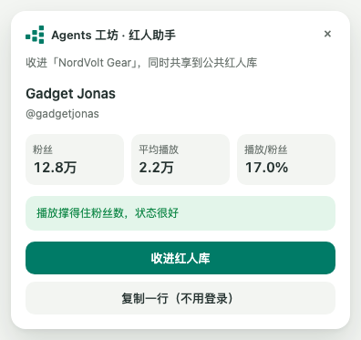
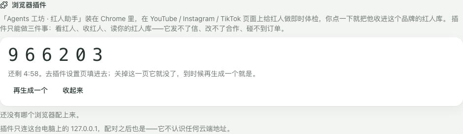
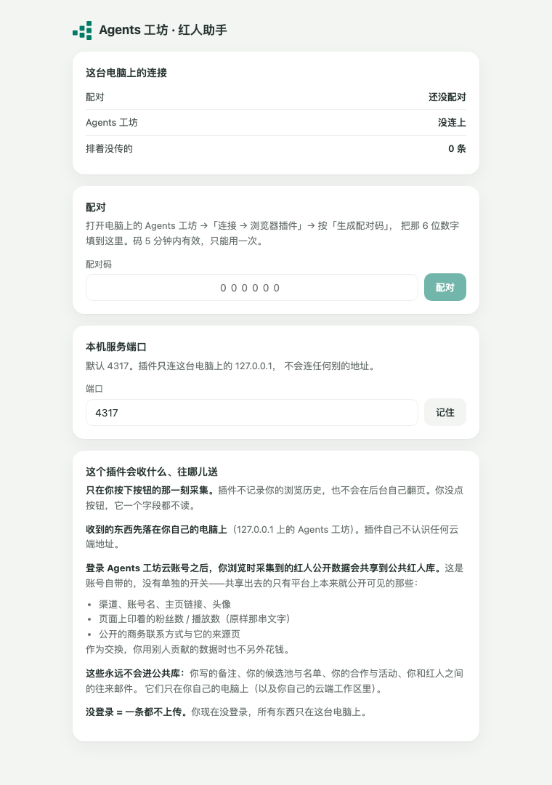

# 68 浏览器插件（Agents 工坊 · 红人助手）v1

给内测用户的一页纸。WP119。

装它用三分钟。装完之后，你在 YouTube 上看到一个人，**不用离开那一页**就知道他值不值得联系。

> **WP119b（09-20）起的两仓分工**：本仓的 `apps/extension` 改定位为**开放接口的参考实现**（功能精简）；内测用户装的是**官方完整版**，从私有 Release 拿 zip（完整版不开源，理由见私有仓 README）。任何第三方都可以照 **`docs/76-插件开放接口-v1.md`** 自己写插件接进来：配对改成**配对时绑定**（任何扩展都能配，码换令牌那一刻绑死 Origin），配对表落 SQLite（重启不用重配），工作台上逐个可吊销。仓库里有守卫测试：私有插件与模板的代码标识出现在本仓任何源码文件里就当场红。

---

## 它解决什么

做红人营销的人每天重复同一套动作：开一个频道 → 看粉丝数 → 心算播放跟粉丝对不对得上
→ 决定要不要记下来 → 切到表格里粘一行。

这个插件把这四步压成一步：在那一页上按一下。

**不用登录、不用装桌面应用就能用的：**

- **即时体检**：播放/粉丝比、平均播放，还有买粉防护——粉丝一大堆但几乎没人看的账号，
  它会直接说出来。
- **复制一行**：一行制表符分隔的数据进剪贴板，切到飞书多维表或 Excel 直接粘。

**配上桌面应用之后多出来的：**

- **一键收进红人库**（收进的是你自己电脑上那个库）。
- **搜索结果页批量收**，可以先按最低播放 / 最低订阅过滤。
- 桌面应用没开时插件先排着，等你打开它自己补上去。

---

## 装：三步

### 1. 解压

从 Release 页面下 `agentsws-influencer-assistant-<版本>-chrome.zip`，解压到一个
**你不会随手删掉的位置**（比如「文档/Agents 工坊插件」）。

> Chrome 的开发者模式插件是「从这个文件夹加载」，不是「装进 Chrome 里」——
> 文件夹删了插件就没了。

### 2. 开发者模式加载

1. Chrome 地址栏输 `chrome://extensions`，回车；
2. 右上角打开**开发者模式**；
3. 左上角点**加载已解压的扩展程序**；
4. 选刚才解压出来的那个文件夹里的 `chrome-mv3` 目录。

装好之后工具栏上会多一个图标。**按一下它，页面右上角出现那块面板。**
（它没有弹窗——你要一边看那个人的主页一边看体检结果，弹窗会挡着。）

现在打开任意一个 YouTube 频道页试试：体检结果已经能看了。

### 3. 配对（想一键收进红人库才需要）

1. 打开电脑上的 **Agents 工坊**，进「连接」→ 往下找到**浏览器插件**；
2. 按**生成配对码**，屏幕上出来 6 位数字（**5 分钟内有效，只能用一次**）；

   

3. 回到 Chrome，在 `chrome://extensions` 里找到这个插件 →「详情」→「扩展程序选项」
   （或者在页面面板上按「去配对」）；
4. 把那 6 位填进去，按**配对**。

配上之后面板第一行会告诉你「收进哪个品牌」。

---

## 它会收什么、往哪儿送

**只在你按下按钮的那一刻采集。** 插件不记录你的浏览历史，也不会在后台自己翻页、
自己滚动。你没点按钮，它一个字段都不读。

**收到的东西先落在你自己的电脑上。** 插件唯一会发请求的地方是 `127.0.0.1`——
它不认识任何云端地址。

**登录了 Agents 工坊云账号之后，你浏览时采集到的红人公开数据会共享到公共红人库。**
这是账号自带的，**没有单独的开关**。共享出去的只有平台上本来就公开可见的那些：

- 渠道、账号名、主页链接、头像
- 页面上印着的粉丝数 / 播放数（原样那串文字）
- 公开的商务联系方式与它的来源页

作为交换，你用别人贡献的数据时不另外花钱。

**这些永远不会进公共库**：你写的备注、你的候选池与名单、你的合作与活动、
你和红人之间的往来邮件。

**没登录 = 一条都不上传。**

同一段话也写在插件自己的设置页上（`chrome://extensions` →「详情」→「扩展程序选项」）：

---

## 常见状况

**「连不上这台电脑上的 Agents 工坊」**
桌面应用没开，或者它没用默认的 4317 端口。先把应用打开；端口确实不是 4317 的话，
在插件的设置页底下改一下。

**「配对码不对」**
码只活 5 分钟、只能用一次。回工作台再按一次「生成配对码」。

**面板上说「还有 N 条排在插件里没传上去」**
桌面应用当时没开，插件把它们收着了。打开应用，最多等 5 分钟它自己就补上去了
（或者在任何一页上再按一次「收进红人库」，会先补旧的再收新的）。

**「这一页我看不懂」**
这一版认三种页：某个人的主页、某条视频、一页搜索结果。别的页（首页、订阅页、
播放列表）没有可采的东西。Instagram 与 TikTok 这一版只做了主页。

**体检说「这一页上没印够数字，算不了」**
页面上没显示粉丝数或者没有近期作品的播放数（有些频道把这些藏起来了）。
这时候体检给不出结论——它不会编一个。

**想换一个品牌收**
插件设置页里「解除配对」，然后在新品牌的连接页上重新生成一个码。
已经排着没传的那几条会留着，配上新的就补进新库。

**不想用了**
`chrome://extensions` 里把它删掉。顺手去工作台的「连接 → 浏览器插件」把那一把**撤掉**——
删插件只是这台电脑上没有了，撤令牌才是让那把钥匙作废。

---

## 相关

- 上架材料草稿：`apps/extension/STORE.md`
- 红人营销全流程：`docs/66-红人营销全流程验证-v1.md`
- 红人库与公共红人库：`docs/48` §5
