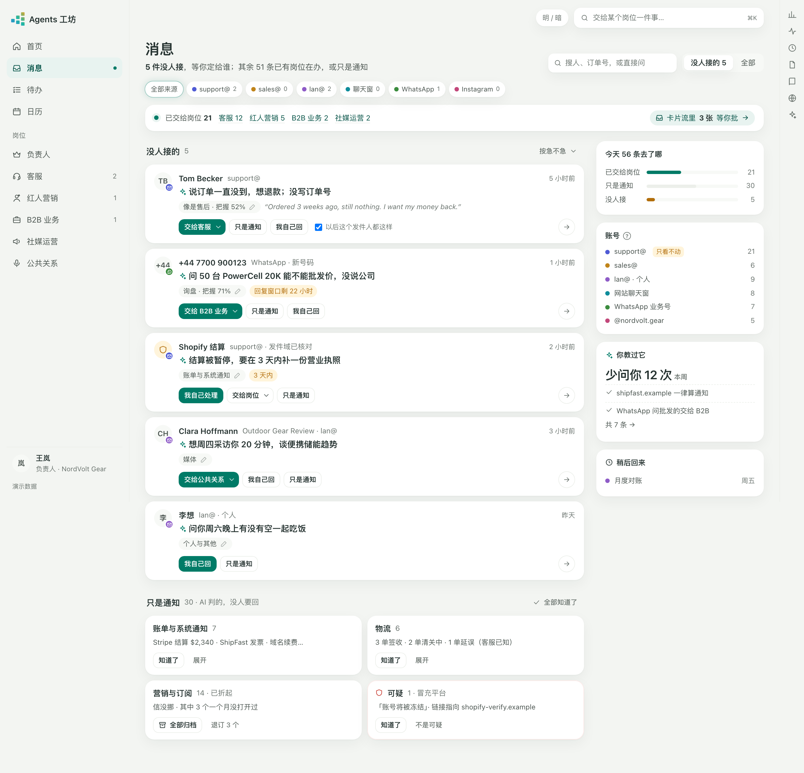
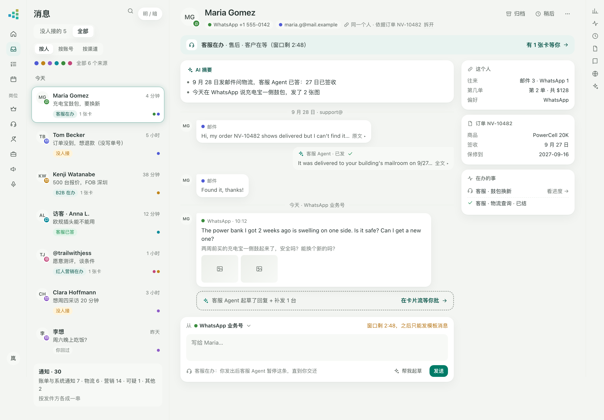

# 88 · AI 消息中心 v1（WP205：调研 + 设计，不含实现）

| | |
|---|---|
| 日期 | 2026-09-30（同日两版：WP205 初版；WP205b 按「消息 vs 卡片流」口径改写） |
| 起因（Luoye 09-30） | 「我们能不能做一些创新的消息展示方式，这种传统的布局信息显示很局促。现在只接了一个邮箱，后面如果接多个邮箱，以及在线聊天渠道该怎么办。消息进来，应该有『标签』或者什么的判断吧，就是我们也要把这个工具改造得以 AI 为核心。」 |
| 口径（Luoye 09-30 定，原文在 docs/35「消息 vs 卡片流」） | 一件要你决定的事**只在一个地方出现：卡片流**（首页 / 岗位 / 职责页），不管来源；岗位 / 职责下挂 Agent 在办的对话与任务；**消息页只管两件事**：① 兜底（默认只看「没人接的」）② 原件档案（「全部」按账号 / 渠道 / 人看原始往来） |
| 状态 | 调研与设计稿完成（第二版），**待 Luoye 看稿**（§8）；这一份不改任何代码与契约 |
| 关联 | 63（消息与邮箱全量接入：分拣三层、文件夹、回写、「客信怎么动邮箱」开关、发件规则）、36（少字、卡片、三栏、§13 客服永不做与「只教不回」）、54（岗位是任务主入口、岗位内路由）、56（社媒与社群、社群管理）、74（在线聊天）、WP182（B2B 询盘、WhatsApp 入口）、WP207（左栏岗位下挂对话与任务）、WP208（消息页里的「AI 助手」）、24（学习回路）、48 §5.2（`kol-core` 同一人合并） |
| 设计稿 | 第二版：`docs/design/inbox/direction-a-unclaimed.html`（没人接的）、`docs/design/inbox/direction-b-archive.html`（原件档案）；第一版留作对比：`direction-a-briefing-v1.html`、`direction-b-conversation-v1.html`。单文件、内联、无外部脚本；`?theme=dark` 看暗色，窄于 700px 自动切手机排法；截图 `docs/design/inbox/shots/`（第一版的带 `-v1-`） |

## 0. 定位（第二版）

**消息页不是第二个待办箱。** 一件要你拍板的事——Agent 起草的回信、报价、补发、合作——只在**卡片流**里出现一次，在那里批；岗位 / 职责下面看 Agent 正在办的对话和任务；**消息页只做两件别处做不了的事**：

1. **兜底**：默认只看「没人接的」——分拣没归到岗位的、AI 拿不准的、个人来信、系统通知。每条给一句 AI 摘要和三个建议：「交给某岗位」「只是通知」「我自己回」。交给岗位之后，这件事就是那个岗位的事，**以后只在卡片流里出现，消息页不再催**。
2. **原件档案**：切到「全部」，按人 / 账号 / 渠道看原始往来，跨渠道串成一条时间线。Agent 在办的只挂一个小标签「客服在办 · 有 1 张卡等你 →」，点了跳到那张卡；**消息页里不放批准按钮**。人想亲自回，也在这里写。

第一版（今日简报三段 + 草稿卡在消息里批）的问题正是 Luoye 指出的：它把卡片流又做了一遍，同一件事在首页、岗位页、消息页三处都能批，人会分不清"到底在哪处理"。第二版把"要你决定的"整块还给卡片流，消息页只留**没人管的**和**原件**。

每条消息仍先由 AI 判断四件事——**是什么（类型）、归谁（岗位）、要不要你、急不急**——外加一行摘要；判断可一键改，改过的记成看得见的规则（§3）。不同的是「要不要你」这一格在消息页上**只剩两种状态：没人接 / 已交出去**。

现在的消息页（`docs/assets/workstation/v2-messages.png`）是四列：左栏导航、文件夹与标签、会话列表、阅读区；每一行长得一样，Agent 已经处理完的客服信、等你批的补发、平台账单是同一种灰。

---

## 1. 调研

只看公开页面与帮助文档，不注册、不登录，也没有拷任何界面素材。日期以 2026-09-30 能查到的为准；标「未核实」的是只在搜索摘要或第三方页面看到的。

### 1.1 一张表

| 产品 | 核心想法（按"要你做什么"组织的那一招） | 适合我们 | 不适合我们 |
|---|---|---|---|
| **Gmail · AI Inbox（beta）** | 打开不是列表，是两块：「建议你做的」（加粗写要做什么）+「要跟上的主题」（跨线程摘要：行程、订单）。可标完成、移除、点赞点踩 | 首屏放"待你决定的事"而不是信 | 首次生成要几天、只看 Primary；我们要按岗位分，不只按个人 |
| **Superhuman** | Split Inbox + 按意图的 Auto Labels（需回复 / 会议 / 营销 / 陌生推销），每个对话顶上一行 Auto Summarize，Auto Drafts，没回就提醒跟进 | 一行摘要随新信更新；意图标签当分栏 | 纠错机制查不到（未核实）；键盘流是锦上添花 |
| **Shortwave** | 收件箱 = 待办；Splits 分栏、按发件人 Bundle 整组稍后 / 删除；自然语言 AI 过滤器，「Reapply」能看到 AI 为什么这么判 | 捆（bundle）整组处理；"为什么这么判"看得见 | **刻意不做统一收件箱**——我们正相反 |
| **HEY** | 按**发件人**分流不靠 AI：陌生人先过 Screener，放行后指定去 Imbox / Feed / Paper Trail；Reply Later、Set Aside、Bubble Up；个人与工作账号用 ▲ / ■ 区分；09 月起开放 CLI / MCP 给 agent | 「改一次，这个发件人以后都这样」；账号用形状 / 颜色区分 | Screener 挡陌生人不适合做生意——客户第一次来信本来就是陌生人 |
| **Spark** | Smart Inbox 分三类卡片（真人 / 通知 / 新闻信）；Gatekeeper；多账号三种显示：统一 / 按账号分组 / 分开；AI Auto-Labels 固定七个且**官方说不从纠正里学** | 多账号"统一 + 可按账号看"；固定一小套类型 | 七个标签是个人邮箱口径，没有岗位 |
| **Notion Mail** | 一句提示词 + 勾几封样本 = 一个自动标签，再选 Split / Keep。据第三方报道已于 2026-09 关停，理由是过半用户靠 agent 处理邮件、不再打开收件箱（未核实官方原文） | 佐证方向：收件箱正在变成"人审 agent 的工作台" | —— |
| **Front** | 共享收件箱 + 规则 + AI：Topics 从历史里自动发现联络原因（要每月 1000+ 会话才准）、Autopilot 按主题自动回、混了多个主题就不自动回；人可「Step in」；联系人**只能手动合并** | 混主题就不自动发；人一介入 Agent 立刻停 | Topics 要量——小团队没这么多会话，得靠固定类型 + 规则 |
| **Missive** | 团队邮件客户端；Instagram / WhatsApp / 短信 / 聊天与邮件同一列表同一套分派、标签、稍后；AI 规则可自带模型 key、「用 AI 起草」进草稿待审；账号着色要靠规则 | 多渠道同一列表、同一套动作 | 规则编辑器是给管理员的——违反 36 §13.2「不给增删改排表单」 |
| **Intercom（Fin + Inbox）** | 每个人都有一个钉住的「Fin AI Agent」文件夹：全部 / 已解决 / 升级与转人工 / 进行中；收件箱内双向翻译（进来译成客服语言、回去译回客户语言）；邮箱相同、WhatsApp 号码与已有用户电话相同时**自动合并**线索与用户，另有"疑似重复"提示 | "AI 已处理 / 转人工"是一等公民；译文就在卡里；强信号自动合、弱信号提示 | 按席位的 Copilot 计费模型与我们无关 |
| **Gorgias**（电商专用） | AI Agent 自带一个视图，按生命周期标签分段（处理中 / 已答 / 稍后 / 已关 / 转人工 / 忽略 + 待复核）；每条消息固定 23 个意图 + 3 档情绪，人可增删意图；按订单号 / 邮箱 / 电话搜人手动合并，合了不可逆 | 电商口径的意图、"待复核"一段；按订单号认人 | 23 个意图对"一人公司"太细；合并不可逆 |
| **Zendesk AI** | 智能分拣给每张工单打意图 / 情绪 / 语言 / 实体，**每项各有置信度**，写进字段供视图、触发器、SLA 用；官方说人改了**不训练模型**；WhatsApp / Instagram 发件人永远新建用户（不按邮箱电话认） | 每个判断带把握；按语言分 | 纠正不学、跨渠道不认人——正是我们要做得更好的两处 |
| **Help Scout** | AI Drafts 可由工作流自动生成、人在弹窗里挑版本 / 按提示改；AI Topics 自动归 8–15 个主题，人可改但**不回流**（beta） | 草稿改一次出新版本，不覆盖 | 同上：纠正不回流 |
| **Chatwoot**（开源 MIT） | 一个渠道一个 inbox、统一会话列表、优先级四档、稍后、批量；Captain 助手直接回客户、答不了转人工（pending → open）；Copilot 起草点「USE」进回复框；结案后提 FAQ 进「待审」；**联系人合并不可逆** | 结案 → 待审知识（我们已有"教一句 → 知识候选"）；批量动作 | 助手直接回客户不经人审——与我们 L2 起步不同；合并不可逆 |
| **Linear Triage / Asks** | 所有外来请求先进团队的 Triage；AI 建议团队 / 负责人 / 标签 / 重复项，**每条建议带白话理由和备选**，可按属性、按取值设「显示 / 隐藏 / 自动应用」；接受、拒绝、合并重复、稍后（到时间或有新动静时回来） | **信任逐档放开**：先只显示建议，准了再对某一类自动应用；"有新动静就回来"的稍后 | 工程工单语境；自动应用要付费档 |
| **Outlook** | Focused / Other 两栏，「总是移到…」按发件人记规则，微软说手动移动会训练模型；Copilot 按你写的一句话判高 / 中 / 低，打开时说为什么重要 | "为什么重要"一两句就在信上 | 只有两栏，太粗 |
| **Inbox Zero**（AGPL + 附加条款） | 自然语言规则 + 静态条件；Test 页先空跑；History → Fix 解释哪里判错就改规则；学到的发件人模式可见可改；Reply Zero 追"待我回 / 等对方回"；陌生推销拦截；批量退订按打开率排 | 纠错 → 可见可撤销的规则；"一个月没打开过"的订阅批量退 | 许可证不许商用嵌入：**只借想法，一行代码都不搬** |

主要出处（均为公开页）：Gmail `support.google.com/mail/answer/16845247`；Superhuman `superhuman.com/ai`；Shortwave `shortwave.com/docs/guides/ai-assistant/`；HEY `hey.com/features/`、`help.hey.com/article/1189-using-ai-agents-with-hey`；Spark `sparkmailapp.com/help/spark-ai/auto-labels-in-spark`；Front `help.front.com/en/articles/3329344`；Missive `missiveapp.com/docs/advanced-features/rules/ai-rules`；Intercom `intercom.com/help/en/articles/7860256`、`/10545610`、`/2614580`；Gorgias `docs.gorgias.com/en-US/understand-ai-agent-tags-and-ticket-views-5414491`；Zendesk `support.zendesk.com/hc/en-us/articles/4550640560538`；Help Scout `docs.helpscout.com/article/1773`；Chatwoot `github.com/chatwoot/chatwoot`；Linear `linear.app/docs/triage-intelligence`；Outlook `support.microsoft.com/…/prioritize-my-inbox`；Inbox Zero `docs.getinboxzero.com/essentials/reply-zero.md`。

### 1.2 横着看，最有用的五条

1. **主轴是"AI 做到哪了"，渠道只是筛选。** Intercom 的 Fin 文件夹、Gorgias 的 AI 视图、Gmail AI Inbox 都把"AI 已处理 / 等人 / 转人工"放在最前；渠道和账号退成一枚小色点。我们本来就有岗位与卡片，这一条几乎是现成的。
2. **判断带理由、带把握，逐档放权。** Linear 每条建议附一句白话理由和备选，并能按类别设"只显示 / 自动应用"；Zendesk 每项各有置信度。对应我们：每枚判断胶囊能展开"为什么"，把握不够的不挪不动（63 已有 0.6 线），准了再对某一类自动。
3. **纠正要被学到，而且学到的东西看得见。** Zendesk、Help Scout、Spark 都明说"人改了不训练模型"；HEY / Spark / Outlook 的做法是"改一次，这个发件人以后都这样"；Inbox Zero 把学到的模式列出来可改。我们已有发件人规则（63 §D ②）和学习回路（24），缺的是把它**摆到界面上**："你教过它 · 这周少问你 12 次"。
4. **噪音成捆处理，不一封一封点。** Shortwave / HEY 的 Bundle、Gmail 的订阅管理、Inbox Zero 按打开率批量退订。平台通知、物流、营销对跨境卖家是大头，折成一行、整捆标已读 / 归档。
5. **跨渠道认人：强信号自动、弱信号提示、合了能拆。** Intercom 同邮箱 / 同电话自动合；Zendesk 的 WhatsApp / Instagram 永远新建人（于是同一个客户变三个人）；Chatwoot / Gorgias / Zendesk 合并都不可逆。我们照 `kol-core` 的纪律：弱信号只出建议卡，合并记 `merged_from`，随时拆得开。

另一条侧面的佐证：Notion Mail 关停、HEY 把邮箱开放给 agent，说明"收件箱"正在变成"人审 agent 的工作台"——这正是 Agents 工坊一开始的形状（36：只有要人决定的才是卡）。

---

## 2. 信息架构：三处分工

### 2.1 三处各管什么

| 地方 | 管什么 | 不管什么 | 谁在这里干活 |
|---|---|---|---|
| **卡片流**（首页「今天要你决定的」、岗位页、职责页） | **一切要你决定的事**，不论来源：出站草稿、补发、报价、合作、接管、改判学到的规则提议…… | 原文往来；没人接的消息 | 你批、改、驳 |
| **岗位 / 职责下的对话与任务**（左栏岗位展开，WP207） | Agent 正在办的会话与任务：办到哪了、下一步、历史 | 批准（批在卡片流）；原件翻找 | 你看进度；Agent 干活 |
| **消息页** | ① **没人接的**（兜底，默认视图）② **全部**（原件档案，按人 / 账号 / 渠道） | 批准；Agent 在办的事的进度 | 你分派、亲自回、翻原件 |

一句话记：**卡片流 = 要你定；岗位 = 谁在办；消息 = 没人管的 + 原件。**

### 2.2 每类消息去哪

| 进来的是什么 | 分拣结果 | 去向 | 消息页上 |
|---|---|---|---|
| 客户问题 / 售后 / 询盘 / 红人回复，对应岗位**开着**且判得准 | 自动交给岗位（63 §D 的 support / kol / b2b 三条路） | 岗位接；要你定的出卡 → 卡片流 | 「全部」里挂「客服在办 · 有 N 张卡等你 →」；**不进「没人接的」** |
| 同上，但 AI 拿不准（`suggested_route`，把握 < 0.6） | 留在收件处 | **没人接的**，建议「交给客服？」 | 主按钮就是 AI 建议的那个岗位 |
| 同上，但对应岗位**没开** | 留在收件处 | **没人接的**，建议「我自己回」或交给别的岗位 | —— |
| 媒体 / 合作 / 其他要回的业务信，有对口岗位（公共关系…） | 第一版不自动交（这些岗位的自动接管还没做） | **没人接的**，建议「交给公共关系」 | —— |
| 个人来信 | —— | **没人接的**，建议「我自己回」 | —— |
| 账单与系统通知里**要你动手的**（结算暂停、账号风险） | —— | **没人接的**，建议「我自己处理」，标急 | —— |
| 其余账单 / 系统通知 / 物流 | `needs_reply = false` | **只是通知**：成捆，整捆「知道了」 | 「没人接的」下面一段，折成捆 |
| 营销与订阅 | 同上 | 成捆、默认折起、不动邮箱 | 同上 |
| 可疑 | 旗（不是类型） | 单独一捆、红框，只提示不删 | 同上 |

### 2.3 卡片和消息怎么互相跳

```
消息页「没人接的」──「交给客服」──► 岗位接手（分拣记 by=user）
        │                                   │ 有要你定的
        │                                   ▼
        │                           卡片流里的一张卡 ──「看原件 →」──┐
        │                                   ▲                       │
        │                                   │「有 1 张卡等你 →」     ▼
        └──「→ 看原件」──────────► 消息页「全部」· 这个人的时间线 ◄──┘
                                            │
                                  岗位对话 ◄─┘「在办的事 · 看进度 →」
```

- **消息 → 卡片**：「全部」里 Agent 在办的会话，头上一条「客服在办 · 有 1 张卡等你 →」；时间线里 Agent 起草的那一处只画一个虚线占位「客服 Agent 起草了回复 + 补发 1 台 · 在卡片流等你批 →」。点了跳到那张卡（首页或岗位页，高亮）。**没有批准按钮**。
- **卡片 → 消息**：来自消息的卡，证据层里多一条「看原件 →」，跳到「全部」里这个人的时间线、定位到那一封。
- **消息 → 岗位对话**：右边「在办的事」每一件「看进度 →」进岗位下那段对话（WP207 的落点）。
- **交出去之后**：「没人接的」里那一条立刻消失，底下一行短提示「已交给客服 · 撤销」；这件事以后在消息页只以「全部」里的小标签出现。
- **「已交给岗位 21」那一行**（A 稿顶部）链到各岗位；「卡片流里 3 张等你批 →」链到首页卡片流。它只报数，不列卡。

### 2.4 进来的都是"一件事"

| 来源（`MessageSource`） | 账号是什么 | 现在 |
|---|---|---|
| `email` | 每只邮箱（support@ / sales@ / 个人邮箱…） | 已接，一只 |
| `chat` | 每个站点的聊天窗 | WP124 只落离线留言；要把在线会话也落进来 |
| `whatsapp`（新增成员） | 每个 WhatsApp 业务号 | WP182 只做了入口，服务端还没有收信来源 |
| `instagram` / `facebook` / `tiktok` / …（新增成员） | 每个社媒账号的私信；评论单列一类 | `social-core` 有读口，没进消息库 |

「没人接的」里一行 = 一段会话里等人分派的那件事；「全部 · 按人」里一行 = 一个人（跨渠道串起来，§5.3）；「按账号」「按渠道」里一行 = 一段会话（63 的 `MessageThreadSummary` 口径）。

### 2.5 与现有文件夹的关系

`KefuAgents` / `KOLAgents` / `BtoBAgents` 在服务器上照旧（63 §C，那是用户邮箱的结构，不动），但**不再是消息页的主导航**。「全部 · 按账号」下每只邮箱可再展开成文件夹，给想对照自己邮件软件的人。

---

## 3. AI 判断：四格 + 一行摘要

每条进来先过 63 §D 的分拣（① 线程归并 → ② 发件人规则 → ③ 自动信头 → ④ 便宜档模型，收口三道不变），产出四样：

| 格 | 取值 | 从哪来 | 消息页上 |
|---|---|---|---|
| **类型**（这件事是什么） | 客户问题 · 售后 · 询盘 · 红人回复 · 合作 · 媒体 · 账单与系统通知 · 物流 · 垃圾与营销 · 个人与其他（可扩） | 规则层先给（③ 自动信头 → 账单 / 营销 / 物流；② 发件人规则）；给不出才问模型；**单选** | 灰胶囊，带 ✎；拿不准时写「像是售后 · 把握 52%」 |
| **岗位**（要谁处理） | 已开的岗位之一，或「你」 | `route` + 54 的岗位内路由挑职责 | 「没人接的」里是**建议**（主按钮「交给 X」）；「全部」里是**归属**（「客服在办」） |
| **要不要你** | 消息页上只有两种：**没人接 / 已交出去** | 派生，不让模型猜（见下） | 决定一条在不在「没人接的」里 |
| **急不急**（三档） | 客户在等 · 今天（或「3 天内」）· 不急 | `priority` + 渠道时钟（聊天在线、WhatsApp 24 小时窗口、首响线）；名字与 36 §13.4 的 P0「客户在等」同一份 | 红 / 黄胶囊，「不急」不出；「没人接的」按它排 |
| **一行摘要** | ≤ 40 字，写"这件事要你干什么" | 63 已有的 `summary` | 每条的标题行，前面一颗 ✦ |

### 3.1 「要不要你」：消息页只剩两种状态

第一版的四档（等你批 / 要你看 / Agent 在办 / 只需知悉）里，「等你批」整块归卡片流，「Agent 在办」归岗位，消息页不再画它们。消息页上一条只有两种状态：

| 状态 | 判据（只看事实） | 在哪 |
|---|---|---|
| **没人接** | 没有岗位接（`route = inbox`），而且你还没处理：没点过三个建议之一、没回、没归档、不是通知 | 「没人接的」列表 |
| **已交出去** | 有人接了：归了岗位（分拣自动交，或你点了「交给 X」）；或你接了（点了「我自己回」且回过了 / 标成「只是通知」/ 归档了） | 只在「全部」里，挂一个归属小标签：「客服在办」「客服已答」「你回过」「通知」 |

「只是通知」那一大捆本来就**不算没人接**：AI 已判它不用回（`needs_reply = false`），所以它不进「没人接的」计数，只在下面成捆摆着，整捆点「知道了」。

**为什么派生**：63 §H 的老话——猜错的代价是人以为有人在管，其实那封信谁都没看。

### 3.2 三个建议按钮

「没人接的」每一条三个按钮，**AI 挑一个当主按钮（实心），另两个描边**：

| 按钮 | 做什么 | AI 什么时候把它当主按钮 |
|---|---|---|
| **交给 X**（带 ▾，可换岗位） | = 63 的「这是客服」人工分拣（`confirm-route`）推广到所有岗位：分拣记 `by: user`，交进那个岗位的管线；有要你定的会出卡。默认勾「以后这个发件人都这样」 | 类型对得上一个开着的岗位 |
| **只是通知** | 标已读、收进通知；不开事项、不花钱 | 像通知但没被规则认出来 |
| **我自己回**（通知类写「我自己处理」） | 打开写信框（63 §F：三条建议按需生成，人自己按发送） | 个人来信、要你本人出面的、没有对口岗位的 |

岗位没开时，「交给 X」下拉里那个岗位是灰的，问号里说"客服岗位没开，开了才能交"（63：岗位没开不挪信，这条不许绕过）。

### 3.3 可纠正，而且纠正会被学到

- **每枚类型胶囊都能点**：一个小单选层，只有预设选项（36 §13.2）；层顶写把握与来源（"把握 91% · 模型" / "发件人规则" / "你改过"）。
- 「以后这个发件人都这样」默认勾着 → 写一条 `SenderRule`（63 §D ②，模型之前跑，下次不花钱）。
- 不勾的改动进学习回路（24 §3）的 Lesson 池：同类改动够多了出一张选择卡「以后 WhatsApp 里问批发的都交给 B2B？」——**这张卡在卡片流里**（它是一个要你定的事），学到的东西先问一句再生效。
- **看得见**：A 稿右栏「你教过它」：本周少问你几次、最近两条规则、「共 7 条 →」进规则清单（能撤）。
- **信任逐档放开**（借 Linear）：每个类型各一档「只建议 / 自动交」。第一版除了 63 已自动的三条路（客服 / 红人 / B2B），其余全是"只建议"。

---

## 4. 展示方式（第二版）

两稿用同一份合成数据：6 个来源（support@ / sales@ / 个人邮箱 / 聊天窗 / WhatsApp / Instagram），当天 56 条：已交给岗位 21、只是通知 30、没人接 5。人名、公司、地址全是编的，域名一律 `.example`，电话用虚构号段。

### 4.1 方向 A「没人接的」——消息页的默认视图



- **顶上一句话**："5 件没人接，等你定给谁；其余 51 条已有岗位在办，或只是通知"。右上「没人接的 5 / 全部」切换。一排来源胶囊（色点 + 这一视图里的数）。
- **一行「已交出去」**：「已交给岗位 21 · 客服 12 · 红人营销 5 · B2B 业务 2 · 社媒运营 2」，每个岗位名是链接；右端「卡片流里 3 张等你批 →」。Agent 在干活时行首一颗呼吸点（36 §12.2）。**这一行只报数、不列卡**。
- **没人接的**：每件一张卡——头像（右下角渠道角标，底色 = 账号色）+ 人 + 来源 + 时间；一行 AI 摘要；类型胶囊（拿不准时带把握）+ 急不急；原文一句（淡色斜体）；三个建议按钮 + 「以后这个发件人都这样」+ 右下 → 看原件。
- 「交给 X ▾」展开是岗位单选（`a-desktop-handoff-light.png`）：AI 建议的那个在最上面、标「AI 建议 · 售后」；底下一句"交出去后这件事归客服，有要你定的会出卡；这里不再催"。
- **只是通知**：成捆（账单与系统通知 7、物流 6、营销与订阅 14、可疑 1），整捆「知道了 / 全部归档 / 退订 3 个」。
- **右栏**：今天 56 条去了哪（已交给岗位 / 只是通知 / 没人接）、各账号数（影子模式邮箱标「只看不动」）、你教过它、稍后回来。
- **手机**：顶部「没人接的 / 全部」分段，已交出去那一行缩成两个岗位 + 卡片流入口，卡片一列（`a-mobile-light.png`）。

### 4.2 方向 B「原件档案」——「全部」视图与点进去的对话



- **左栏**：「没人接的 5 / 全部」+「按人 / 按账号 / 按渠道」；账号色点筛选。按人时每行是一个人：名字、最近一句、**归属小标签**（客服在办 · 1 张卡 / 没人接 / 客服已答 / 你回过）、右端这个人来过的账号色点。通知按发件方各成一串，折在最底下。
- **右边这个人的全部往来**：
  - 头：人 + 各渠道身份胶囊 +「同一个人 · 依据订单 NV-10482 · 拆开」；右上 归档 / 稍后 / ···。
  - **归属条**：「客服在办 · 售后 · 客户在等（窗口剩 2:48）　有 1 张卡等你 →」——整条是一个链接，跳卡片流。
  - AI 摘要（两三句前因）。**没有"下一步：批准…"那一块**——下一步在卡上。
  - 时间线：跨渠道按天排，老的原文折一行，Agent 已发的也折着；今天的来信整段 + 译文 + 图。
  - Agent 起草的那一处：**虚线占位**「客服 Agent 起草了回复 + 补发 1 台 · 在卡片流等你批 →」，不展开草稿、不放按钮。
  - **底部亲自回信**：「从 [WhatsApp 业务号 ▾]」（从这个人的哪个身份回，由你选；WhatsApp 标窗口剩多久）、写信框、「帮我起草」（63 §F 的建议）、发送。发件照 63 §F：人自己写的信走 `channels.sendMail`，收件人从入参来，不出卡。
  - 这是**岗位在办的会话**，所以写信框下面一行：「客服在办：你发出后客服 Agent 暂停这条，直到你交还」——亲自回 = 63 §H 的「我来接手」，发出那一刻自动接管（这与 36 §13.3 的关系见 §8.3 第 1 条）。非岗位的会话没有这一行。
  - 最右上下文：这个人（往来次数、第几单、偏好渠道）、订单、**在办的事**（每件「看进度 →」进岗位对话）。
- **手机**：只显示这个人的时间线，顶上「‹ 全部」（`b-mobile-light.png`）。

### 4.3 考虑过、没画的：看板

四列泳道拖卡片。不画：消息的状态由事实决定（有没有人接、有没有卡），不该由人拖；而且"要你决定的"已经有卡片流了。

### 4.4 推荐：A 做消息页默认，B 是「全部」与「→ 看原件」的落点

- 打开「消息」是 A：它只放没人管的，天然短——今天 56 条里只有 5 条要你分派。
- 切「全部」或点任何一处「→ 看原件」进 B。
- 两稿的组件是同一套：卡头、胶囊、改判层、身份胶囊、归属标签；和卡片流共享的只有"跳过去"的链接，**不共享批准按钮**。

第一版两张稿与截图留在仓库（`*-v1.html`、`shots/*-v1-*.png`），方便对比。

---

## 5. 卡片、AI 助手、多账号、同一个人

### 5.1 Agent 起草的回复在卡片流里批（第一版这里写反了）

- 挂在会话上的卡（`DeckCard`）只在卡片流里画。消息页里对应的位置只有两种入口：归属条「有 N 张卡等你 →」与时间线里的虚线占位。
- 卡片这一侧加一条证据「看原件 →」（36 §2.2 证据层），跳回消息页这个人的时间线。
- 卡上的草稿仍按第一版的主张给**双语**：客户语言是会发出去的那份，下面淡色中文译文，按需生成（63 §F「按需生成」同一条纪律）。这一条落在卡片组件，不在消息页。

### 5.1b WP208「AI 助手」核对（它该是"兜底处理的助手"）

WP208 把第三栏的邮件助手搬进了消息页阅读区（`apps/workstation/src/components/messages/mail-ai-assistant.tsx`，提交 `afc5dd9c`；核对时它**还没合进 main**，看的是分支 `wp/208-rail` 的 `e0c1707c`，只读）：看信时出现一块可收起的「AI 助手」，头一行分拣结果（归谁 · 急不急 · 拿不准标记，为什么进问号），下面是原邮件助手正文（摘要、回复建议进写信框、发件人、相关待办、转成待办）。

对照本口径：

| 项 | 现状 | 口径 | 结论 |
|---|---|---|---|
| 位置 | 消息页阅读区，只在看信时出现 | 兜底 / 原件档案里的辅助 | ✅ 符合 |
| 不是卡、不批东西 | 不放批准按钮，建议只进写信框、人自己发送 | 消息页不重复批 | ✅ 符合 |
| **岗位在办的信也生成回复建议** | 服务端 `assistant()` 只看 `needs_reply`，客服 / 红人 / B2B 线程上照样生成三条建议（花 token）并显示；页面在只读线程上不接「用建议」事件，于是出现点不动的建议 | 岗位在办的只挂「客服在办 · 有 N 张卡等你 →」，不给人写回复的建议 | ❌ 不符：岗位线程上应不请求建议，换成归属条 + 跳卡链接 |
| **缺三个建议动作** | 只有回复建议与「转成待办」；分派只在「待确认」一栏有「这是客服」 | 兜底助手的主活是「交给某岗位 / 只是通知 / 我自己回」 | ❌ 缺：助手头一行下面应有这三个按钮（`confirm-route` 推广到所有岗位） |
| 分拣那一行 | 显示路由与急不急；没有「类型」 | 四格判断 | ⚠️ 等第 ① 步加「类型」后补上，并让它可点改判 |
| 默认展开 | 展开，每封 `needs_reply` 的信打开就生成一次建议 | 兜底时才需要建议 | ⚠️ 建议改为：没人接的且要回的才自动生成；其余收起或不请求 |

这一单不改代码，以上写进 WP205 报告，留给落地第 ② 步（或单独一张小单）处理。

### 5.2 多账号与渠道

- **账号色**：一个账号一个颜色，专用一套六色（与状态色分开：状态用 `--ws-good/warn/bad/info`，账号用另一套靛 / 青 / 琥珀 / 紫 / 玫 / 绿，明暗各一份），只出现在两处：筛选胶囊前的色点、头像右下角的渠道角标底色。**颜色只说"哪个账号"，不说"好坏"**。超过六个账号循环，并在筛选里配上账号名。
- **渠道**：角标里的小图形说渠道（信封 / 气泡 / WhatsApp / Instagram…；实现时用 36 §8 的 `<BrandIcon>`，设计稿里用的是自画的通用图形）。
- **筛选**：顶上一排来源胶囊，点一个只看这个账号，再点回全部；岗位、类型各一个下拉。筛选状态记本机。
- **影子模式 / 只看不动的邮箱**在右栏账号清单上标「只看不动」（63 §D 那个开关的琥珀色）。

### 5.3 同一个客户跨渠道：合并规则与隐私边界

"人"是一个新的轻对象（`MessagePerson`，§7），挂着这个人在各渠道的身份（邮箱地址、WhatsApp 号码、IG 账号、聊天窗访客）。

| 信号 | 怎么处理 | 理由 |
|---|---|---|
| 同一个邮箱地址（归一后）出现在我们的多只邮箱里 | **自动挂** | 本来就是一个人 |
| 聊天窗访客留了邮箱（74 "按邮箱续聊"那一份） | **自动挂** | 同上 |
| WhatsApp 号码 / 客户报的订单号，对上**本品牌店铺订单**上的电话或邮箱 | **自动挂**，并把"依据订单 NV-10482"写在人头上 | 订单背书的强信号（Intercom 也按同电话自动合） |
| 同名、IG 显示名像、邮箱只差一点 | **只出建议卡**「这两个像是同一个人：合并 / 不是」，永远不自动 | 照 `kol-core/merge`（48 §5.2）的老规矩 |

四条边界：

1. **只在一个品牌工作区内认人**（52：一个品牌一个工作区）。品牌 A 的客户与品牌 B 的客户即使同一个邮箱也不连。
2. **判断只看归一键**（小写邮箱、E.164 电话、平台账号 id），不送模型、不去外面查人（不做"补全资料"）。
3. **合了能拆**：合并记 `merged_from`，人头上一个「拆开」；拆开后各自的会话回到各自那一个人名下。Chatwoot / Gorgias / Zendesk 的合并都不可逆，那是我们要避开的。
4. **删除与导出按人走**：一个人要求删除时，他挂着的每一个身份的原文都在范围里（63 §J、18 §2.1 的 `subject_ref`）。**红人不是客户**：红人那一侧已有 `creator` 与它自己的同一人合并，两边不混；同事与自己的地址永远不合进客户。

---

## 6. 动作

| 动作 | 在哪 | 邮件 | 聊天窗 / WhatsApp / 私信 | 批量 |
|---|---|---|---|---|
| 交给 X | 没人接的 | 人工分拣进岗位；按「客信怎么动邮箱」开关挪信 / 标已读 | 改归属，不涉及挪 | 多选同类一起交 |
| 只是通知 | 没人接的 | 标已读（回写 IMAP） | 本地标已读 | 整捆「知道了」 |
| 我自己回 | 两处 | 写信框（63 §F） | 从这个人的某个身份回；WhatsApp 窗口外只能发模板 | —— |
| 归档（`e`） | 两处 | 回写 IMAP（63 §G） | 只在本地关掉 | 整捆、多选 |
| 删除 | 两处 | 移到垃圾箱，**二次确认**，能撤销（WP204 已做） | 只在本地隐藏（平台那头删不了，照实说） | 多选；整捆只给归档 |
| 稍后提醒（`h`） | 没人接的 | 本地记；到点或**对方有新消息**时回到「没人接的」 | 同 | 整捆 |
| 改判（`l`） | 两处 | §3.3 | 同 | 多选改类型 |
| 退订 | 只是通知 | 按 `List-Unsubscribe` 发退订（出站，走出站门） | —— | 「一个月没打开过的 3 个」 |

- **消息页没有「批准」这个动作**。
- **「客信怎么动邮箱」开关照旧说了算**（63 §D）：影子模式开着的邮箱，归档 / 删除 / 挪信只在本地生效，按钮旁标「只在这里」（WP204 已按这条置灰并说明）。
- 快捷键沿用 63 §G（`j` `k` `e` `r` `a` `/`），加 `h` 稍后、`l` 改判、`t` 交给建议的岗位。

---

## 7. 契约增量（只加不删，实现时再细化）

| 在哪 | 加什么 |
|---|---|
| `MessageSource` | `'whatsapp' \| 'instagram' \| 'facebook' \| 'tiktok' \| …`（63 §L 早留好的位置） |
| `MessageTriage` | `kind?: MessageKind`（类型，单选）、`kind_by?`（规则 / 模型 / 你改的）；急不急不加字段，用 `priority` + 渠道时钟派生 |
| 新类型 `MessageKind` | 十个内置值（§3），可扩；中英名进 i18n |
| `MessageThreadSummary` | `claim?: 'unclaimed' \| 'handed'`（**服务端派生**，§3.1）、`handed_to?`（岗位 id 或 `'me'`）、`open_card_count?`、`card_link?`、`person_id?`、`snoozed_until?`、`suggest?: { action: 'hand' \| 'notice' \| 'self'; position?: … }` |
| `MessageListQuery` | `claim?: 'unclaimed'`（「没人接的」）；`group?: 'person' \| 'account' \| 'channel'`（「全部」） |
| 路由 | `confirm-route` 推广到所有岗位（现在只认客服 / 红人），不另起一条 |
| 新对象 `MessagePerson` | `id`、`identities[]`（渠道 + 归一键 + 显示值）、`merged_from[]`、`linked_order_refs[]`；一个品牌一张 |
| 卡片证据 | `DeckCard` 的证据里加「原件」引用（消息 id），给「看原件 →」用 |
| 现有 11 个标签 | 不动，降为次要标签；与类型的对照表（订单与物流 → 物流、营销订阅 → 垃圾与营销、账单与发票 / 平台通知 / 账号安全 → 账单与系统通知、合作邀约 → 合作、可疑 → 独立旗标）用于回填 |

---

## 8. 结论

### 8.1 推荐

**A「没人接的」做消息页默认，B「原件档案」做「全部」与「看原件」的落点；要你决定的一律回卡片流。** 三句理由：

1. 这正是 09-30 定的口径：一件事只在一处决定。消息页不再和首页抢活，它的默认视图天然很短（今天 5 条）。
2. 「局促」的根子是所有消息一样重；A 只放没人管的，B 把原件按人串起来，两处都不再是"一列长得一样的信"。
3. 全是现有东西的延长线：分拣三层、发件人规则、`confirm-route`、卡片、岗位路由、学习回路都接得上；新增的只有「类型」一格、「没人接 / 已交出去」的派生、「人」这个轻对象。

少字、明暗、手机三条两稿都守着：卡上可见字只有一行摘要 + 胶囊 + 原文一句 + 三个按钮（36 §7 的 60 字线）；明暗只换令牌；手机 A 是分段 + 一列卡，B 是只显示这个人的时间线。

### 8.2 分几步落地（每步能单独上线）

| 步 | 做什么 | 上线后用户看到什么 | 依赖 |
|---|---|---|---|
| ① 分拣加「类型」与改判 | 规则层先给类型，模型兜底；改判单选层 +「以后这个发件人都这样」写发件人规则；服务端派生 `claim` | 现在的消息列表每行多类型胶囊，点了能改 | 只动消息库与分拣；契约只加 |
| ② 「没人接的」主视图 + 交给岗位 | A 稿：默认只列没人接的；每条三个建议；`confirm-route` 推广到所有岗位；「只是通知」成捆；顶部「已交给岗位 N」一行与卡片流入口；WP208 的 AI 助手按 §5.1b 收成兜底助手 | 打开消息只看到"5 件没人接"；点「交给客服」就再也不在这里催 | ①；**只有一只邮箱也成立** |
| ③ 原件档案 + 互跳 | B 稿：「全部」按人 / 账号 / 渠道；归属小标签；时间线里的虚线占位；卡片证据加「看原件 →」 | 卡片与原件一跳就到；消息页里没有批准按钮 | ②；卡片组件只加一条证据 |
| ④ 亲自回（岗位会话上） | 写信框「从哪个身份回」；岗位在办的会话发出即接管（需 §8.3 第 1 条定） | 在原件里就能自己回 | ③ |
| ⑤ 多渠道 | 聊天窗在线会话全量落库；WhatsApp 收信（接 WP182 入口）；IG / FB 私信（接 `social-core`）；账号色与来源筛选 | 聊天、WhatsApp、私信和邮件同一处 | ①；各渠道连接 |
| ⑥ 同一个人 | `MessagePerson`、强信号自动挂、弱信号建议卡（进卡片流）、拆开、按人删除 | 「全部 · 按人」真正按人 | ⑤ 才有跨渠道的意义；邮箱之间 ③ 之后就能做 |
| ⑦ 手机 | 两稿的窄屏排法 | 手机浏览器能用 | 看远程访问的路 |

建议先派 ① ②：现有一只邮箱就能看出差别，而且 ② 顺手把 WP208 的助手收成兜底助手。

### 8.3 要 Luoye 定的事

1. **岗位在办的会话上"亲自回"与 36 §13.3 冲突**：09-19 定的是「不做人工直接回复客户，只有教 AI」；09-30 口径是「人想亲自回，也在这里写」。稿里的折中是**发出即接管**（63 §H 的「我来接手」：Agent 暂停这条，直到你交还），非岗位的会话照常写。这样可以吗？还是岗位会话上仍只给「教 AI」、要亲自回先手动「我来接手」？
2. **类型清单**：§3 那十个够不够、要不要增删；现有 11 个标签降为次要可以吗？
3. **哪些岗位自动接**：现在只有客服 / 红人 / B2B 自动交；公共关系、社媒运营的消息要不要也自动交（稿里是"只建议"）？
4. **「只是通知」要不要回写邮箱已读**（稿里是回写，和你在邮件软件里看到的一致）？
5. **同一个人**：订单背书的电话 / 邮箱自动认（推荐），还是一律先出建议卡？
6. **营销与垃圾**：只折起、不动邮箱（推荐），还是给「自动归档营销」开关？
7. **WP208 的 AI 助手**：按 §5.1b 收成兜底助手（岗位线程不生成建议、加三个动作、默认只对没人接且要回的生成建议），放在第 ② 步一起做可以吗？
8. **手机**：工作台是本机服务，手机要经云端托管或局域网才能用——排第几步？

### 8.4 自主决定（第二版按我的判断出，Luoye 可改）

- 「没人接」不含通知：通知是 AI 判了不用回的，单独成捆，不算进"5 件没人接"。
- 「已交出去」包含两种：交给岗位的、你自己接下的（回过 / 标通知 / 归档）；「全部」里用归属小标签区分。
- 三个建议里 AI 只挑一个当主按钮；通知类的「我自己回」写成「我自己处理」。
- 时间线里 Agent 起草的那一处画虚线占位，只链不展开——让人知道"这里有一步在等"，又不在消息页重复批。
- 学到的规则提议（"以后 WhatsApp 问批发的都交给 B2B？"）作为一张卡进卡片流，不在消息页问。
- 看板方向不画（§4.3）。
- 设计稿里的渠道图形是自画的通用图形，实现时换 `<BrandIcon>`。
