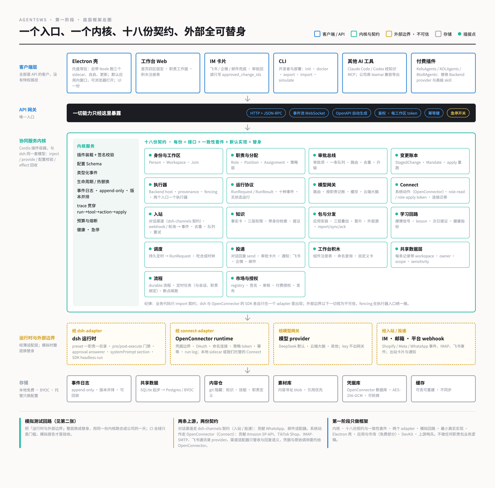
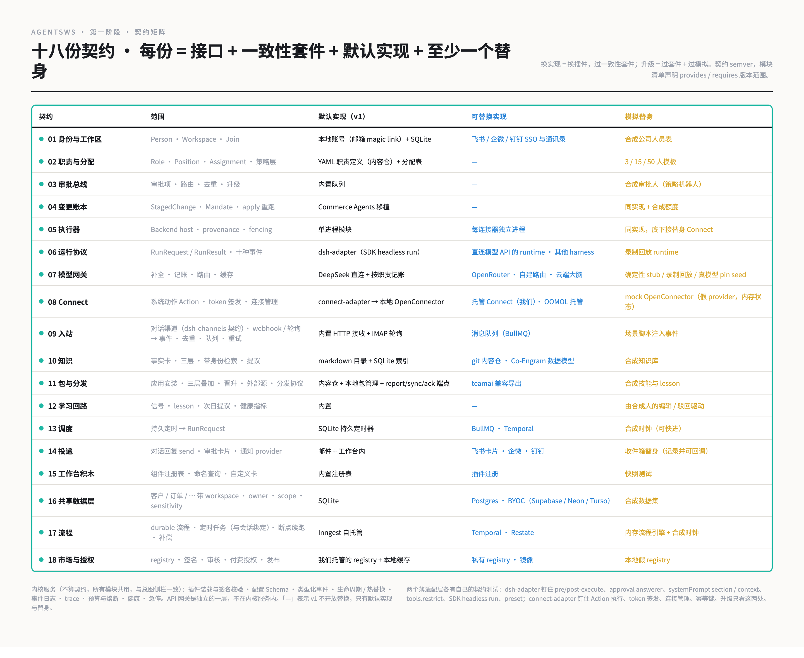
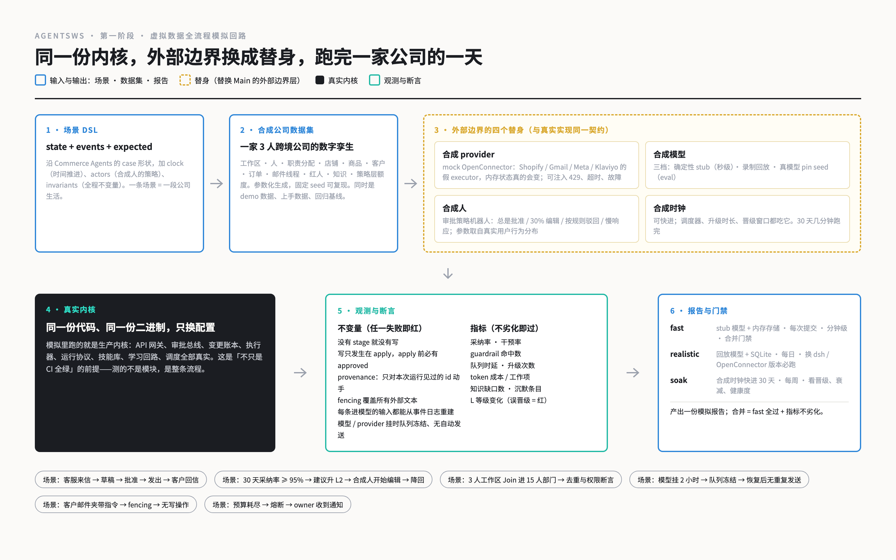

# Architecture

*This is the English entry point for contributors. It is distilled from
`docs/09-底层框架拆解.md` (the source of truth, Chinese) with the security revisions from
`docs/31` §3 and the open-source route in `docs/32`. Where this file and doc 09 disagree,
doc 09 wins. For an honest per-layer inventory of what is actually built, read the status
table in the [README](../README.md) or `docs/38-底层收口清单.md` §1.*

agentsws is a local, open-source agent middle-office for a cross-border e-commerce
company: it connects people, agents, channels and company knowledge into one system that
runs on the company's own machine. It is a **distribution of DeepSeek Harness (dsh)**, not
a fork of it.

---

## 1. Four hard requirements

Everything below follows from four requirements set at the start of the project. They are
the reason the code is shaped the way it is.

| Requirement | Principle | How it lands |
|---|---|---|
| Conform to the DeepSeek Harness design | **Our kernel is dsh's plugin model** | The collaboration service itself runs inside a Cordis container (`@deepseek-ai/cordis`, the one dsh vendors). Each module is a plugin: `inject` declares dependencies, `provide` offers a service, Schemastery validates config, `ctx.effect()` handles teardown, events are typed. Four of dsh's own rules are adopted verbatim: *Plugins, not loop changes*; *Model-visible ⟺ logged*; new data versions ship **alongside**, never rewritten in place; 100% line coverage per file. |
| Everything is an API | **One entrance; all clients are equal** | The service exposes exactly one gateway (HTTP + JSON over `/v1`, OpenAPI generated). The desktop shell, the web workstation, the CLI, the runtime adapters and any third-party client all go through it. There is no privileged UI path. Modules talk to each other through service contracts and never share database tables. |
| Full-flow simulation on synthetic data, not just a green CI | **Every external boundary has a stand-in; the kernel does not change** | Four classes of external dependency (connector providers, models, humans, the clock) each have a stand-in implementation obeying the same contract as the real one. A simulation run is the *same* kernel with the boundaries pointed at stand-ins. |
| Modules are pluggable and upgradable | **Contract + consistency suite + versioned manifest** | Each module is one contract (TypeScript interfaces + events + error codes, semver), one consistency suite every implementation must pass, and at least two implementations (default + stand-in). Swapping an implementation is swapping a plugin; upgrading means passing the suite and the simulation. |

Two disciplines cut across the whole tree:

- **Business code imports contracts only** — never dsh, never the OpenConnector SDK. Each
  of those lives behind exactly one adapter package (`dsh-adapter`, `connect-adapter`).
- **Everything below the external boundary is untrusted input.** Customer email, order
  notes, page content, connector responses, meeting transcripts. Fencing happens once, at
  the executor entrance.

---

## 2. Layers

```
Clients        desktop shell · web workstation · CLI · IM cards · other AI tools · paid plugins
                 │  all of them go through
API gateway    HTTP + JSON /v1 · OpenAPI · auth · idempotency · rate limit · halt
                 │
Kernel         Cordis container — plugin loading, config validation, typed events,
               lifecycle, append-only event log, health, halt, trace
               Contract modules (§3): identity · roles · approvals · ledger · executor ·
               run protocol · model gateway · Connect · inbound · knowledge · skills ·
               learning loop · scheduling · delivery · blocks · shared data
                 │  through two thin adapters and the gateway
External       dsh runtime (dsh-adapter) · OpenConnector runtime (connect-adapter) ·
boundary       model providers (model gateway) · mail / webhooks (channels)
(untrusted)      │
Storage        event log (append-only) · shared data (SQLite → Postgres) ·
               controlled raw-material store · OpenConnector credential vault (encrypted)
```



---

## 3. The contracts

All of them live in `packages/contracts/src/` as pure TypeScript — types, events, error
codes, no implementation. Numbers `#1`–`#18` are doc 09 §2's; `#19` and the meetings
kernel were added during implementation. **The interfaces are frozen** (`docs/32` §2):
adding fields, kinds, events and error codes is allowed; changing the meaning of an
existing one requires a major version and a migrator.

| # | Contract | File | One line |
|---|---|---|---|
| 1 | Identity & workspace | `identity.ts` | Person, Workspace, Join; v1 is a local email magic-link provider, single workspace. |
| 2 | Roles & assignments | `roles.ts` | Role definitions (YAML), positions, assignments, the policy layer, write-action specs, Casbin policy compilation. |
| 3 | Approval bus | `approval.ts` | Approval item kinds, routing, dedupe, escalation, decisions bound to a decision token. |
| 4 | Change ledger & guardrail | `changes.ts` | `StagedChange`, the change-kind catalogue with per-kind `risk_class`, mandates and caps. |
| 5 | Executor | `changes.ts` | `stage` / `apply` / `reconcile` / `cancel`; provenance and fencing at the entrance; three-state apply. |
| 6 | Run protocol | `run.ts` | `RunRequest` / `RunOutput` and ten run events; stateless — a run carries all its context. |
| 7 | Model gateway | `model.ts` | Completion, routing, accounting per (workspace, assignment, role, run, purpose), three budget levels, residency, halt, transcription. |
| 8 | Connect | `connect.ts` | Action execution, scoped token issuance, connection management, proxying. Credentials never appear in a return value. |
| 9 | Inbound | `channels.ts` | Channel adapters, the inbound pipeline (dedupe, fencing, secret scrubbing, routing, dead-letter, retry). |
| 10 | Knowledge & memory | `knowledge.ts` | Fact cards, three layers, identity-aware retrieval, proposal queue, run memory discipline. |
| 11 | Packages & distribution | `packages.ts` | `package.yml`, extension points, local install/upgrade. Contract only — see §7. |
| 12 | Skills & learning loop | `skills.ts` | Agent Skills format with section-level metadata, three-layer overlay by section, lesson pool. |
| 13 | Scheduling | `schedule.ts` | Persistent timers bound to a role, plus the injectable `Clock` every `now()` goes through. |
| 14 | Delivery | `channels.ts` | Outbound delivery of approval cards and notifications. |
| 15 | Workstation blocks | `blocks.ts` | Component registry, named queries executed server-side as the viewer; numbers never pass through a model. |
| 16 | Shared data layer | `data.ts` | Record envelope with scope, owners and sensitivity; optimistic locking; crypto-shredding erasure. |
| 17 | Workflow | `schedule.ts` | Durable workflows over the same scheduler. Contract only — see §7. |
| 18 | Marketplace & licensing | `packages.ts` | Registry, signing, review, publishing. Contract only — see §7. |
| 19 | Work model | `work.ts` | Matter (the one context container), goal, todo, daily plan, review, calendar item. |
| — | Meetings kernel | `meetings.ts` | Meeting, six record sources, controlled raw-material store, transcript → outputs pipeline. |
| — | Kernel & events | `kernel.ts`, `events.ts`, `common.ts` | Module manifest and signing, halt, trace; the append-only event envelope; shared id and actor types. |



---

## 4. Run protocol and the three runtimes

A run is stateless: the collaboration service assembles a `RunRequest` carrying the
assignment, the matter, the allowed tools, the context items and the budget, hands it to a
`RuntimeAdapter`, and gets a `RunOutput` back. Routing lives in the collaboration service,
not in the runtime — a channel message becomes an event, becomes a `RunRequest`.

Three adapters implement the same contract and pass the same scenarios:

| Runtime | Package | What it is |
|---|---|---|
| `stub` | `stand-ins` | Deterministic rule-based drafting. No model call. This is what the `fast` tier uses. |
| `dsh` | `dsh-adapter` | DeepSeek Harness. Our gate plugin occupies five seams: pre-execute, post-execute, approval answerer, systemPrompt section + context injection, and `tools.restrict`. Currently assembled **in-process** via Cordis rather than as a headless subprocess; a real IPC bridge is still to come (`docs/38` §2, WP30). |
| `direct` | `runtime-direct` | A turn loop that talks to the model gateway directly, with no dsh at all. Its reason to exist is to prove dsh is replaceable. |

Everything a model can see must be reconstructible from the event log. That is not a
slogan: the `prompt_replayable` invariant replays `simulation.run_request` and
`context.injected` events through the same assembly function and compares.

---

## 5. Approvals and the ledger

This is the core of the product, so it is worth being precise.

1. An agent never writes. It **stages** a change: `ChangeLedger.stage` produces a
   `StagedChange` with a change kind, a payload, a target `ObjectRef`, provenance for
   every fact it used, and a mandate check against the assignment's caps.
2. Staging creates an approval item and takes a **quota reservation** on
   (assignment, kind, day). The reservation converts on success and is released on failure
   or expiry.
3. The approval item carries an **execution snapshot**:
   `hash(workspace, connection, target + record_version, recipients, final payload,
   attachment hashes, executor version, mandate hash)`. The `decision_token` a human's
   decision produces is bound to `(item_id, revision, execution_snapshot)`.
4. `Executor.apply` recomputes the snapshot. Any component changed → `failed
   {snapshot_mismatch}`, even for idempotent kinds. Applies against the same target and
   kind are serialised.
5. Apply is three-state: `applied` / `failed` / `unknown`. `unknown` goes to a
   confirmation query and then a human reconciliation item; after a restore, reconciliation
   runs before outbound is re-opened.
6. Ordering is enforced: a reply that contains a refund goes out only after the refund is
   `applied`. Approved items have a cancellation window.

**Adoption rate is an experience metric and unlocks nothing.** Every change kind has a
`risk_class`; `medium` and `high` (refunds, reships, publishing, configuration, money) are
always human-reviewed, forever, in v1. That is a deliberate refusal, not a missing feature.

---

## 6. The simulation loop and its six invariants



A scenario is a piece of company life written as YAML: `state + events[] + expected`, plus
`clock` (time advances), `actors` (synthetic approvers with a policy) and `invariants`.
The synthetic pack `packs/dtc-3c-3p` is a complete digital twin of a three-person
cross-border company: workspace, people, assignments, store, products, customers, orders,
mail threads, creators, knowledge, mandates. Same generator, same fixed seed — it is
simultaneously the demo data, the onboarding data and the regression baseline.

Four stand-ins replace the four external boundaries: a mock OpenConnector whose fake
executors keep real in-memory state (a refund actually changes the order) and can inject
rate limits and timeouts; a model in three tiers (deterministic stub, recorded replay, real
model with a pinned seed); synthetic humans with approval policies; and a synthetic clock
that fast-forwards a day of company life in seconds.

Six invariants are asserted across every scenario, and each must be *checked* at least once
rather than vacuously true:

| Invariant | What it forbids |
|---|---|
| `no_write_without_stage` | Any write that did not go through the ledger. |
| `apply_only_after_approved` | Applying anything a human did not approve. |
| `provenance_respected` | Asserting a fact the run cannot show it read. |
| `fencing_covers_external` | External text reaching a model unfenced. |
| `prompt_replayable` | A prompt that cannot be rebuilt byte-for-byte from the event log. |
| `freeze_on_model_outage` | Continuing to send when the model or a provider is down. |

Three tiers: **fast** (stub model, in-memory store — every commit, minutes),
**realistic** (replay model, SQLite — nightly, not built yet), **soak** (clock fast-forward
over 30 days — weekly, not built yet). The merge gate is *fast passes and metrics have not
regressed against the baseline*, and it runs in CI on every push and pull request:

```
pnpm -s simulate --tier fast --pack packs/dtc-3c-3p --scenario 'scenarios/**/*.yml' --seed 42
```

---

## 7. Security model

From `docs/31` §3. These are load-bearing; a contribution that weakens one will not be
merged.

- **Authorization is the whole tuple.** A run binds to exactly one assignment, and its
  scopes apply as written. Filtering is by (domain, ops, range, sensitivity) together —
  any dimension unsatisfied means denied. Dimension-wise union across assignments is
  explicitly *not* done. An assignment with an empty range gets no token, returns no rows,
  and is shown as "no range assigned". The filter is pushed down into SQL, so an
  unauthorised field is never fetched and then redacted; it is never fetched.
- **Approval binds to an execution snapshot** — §5 above.
- **Quota reservation at stage time**, serialised applies, three-state apply with
  reconciliation.
- **Relationship authorization gate.** Provenance only proves the agent *read* something.
  For refund, reship and address change, an `authorization_check` additionally requires
  that the requester's identity matches the target order's customer; otherwise the change
  is blocked and routed to a human. The recipient gate is the same idea on the way out:
  outbound recipients must be existing thread participants or verified customer contacts,
  never an address the model parsed out of a message body.
- **Credentials never pass through a model.** Keys live in environment variables, the
  local AES-256-GCM secret store, or the OpenConnector vault. The one input allowed to
  carry a plaintext credential is `Connect.submitForm`'s `fields`, which forwards and
  forgets. Tests assert zero leakage across responses, the event log, every byte of every
  file in the data directory, the DOM, `localStorage`, and stdout.
- **Erasure without breaking the append-only log**: personal data is encrypted per subject;
  erasing destroys that subject's key and writes a tombstone event. The log stays intact
  and the ciphertext stays unreadable.
- **Plugins are never executed on fetch.** The kernel loader verifies a module manifest,
  its signature and its allowed source; unsigned means failed, and the loader does not run
  an entry point it has not verified.

---

## 8. Boundaries: dsh, OpenConnector, and us

**dsh-channels and OpenConnector are not the same role.** dsh-channels abstracts a
*conversation* — a person exchanging messages with an agent on some platform, with
sessions, streaming, cards, and a `send` that means "reply in this thread". OpenConnector
abstracts a *system action* — one typed request/response call against a business API, with
scopes, idempotency keys and a run log, no session and no inbound. So: a message from a
human goes through channels; a read or write against a business system goes through a
Connect action. We cannot put tools into channels (an action is not a message, and our
executor applies changes *after* approval, when no dsh process is involved), and we cannot
put conversation into OpenConnector (no inbound, no session, no cards).

**Where the line is drawn with dsh.** This repository is a distribution: it pins official
`@deepseek-ai/dsh-*` versions in `profiles/agentsws/` and does not fork the kernel. Every
dsh call is funnelled through `packages/dsh-adapter`. Upgrading dsh is a version bump, a
run of the adapter's seam tests, and a full simulation. Contributions that belong upstream
(channel adapters, connector providers) should go upstream; `vendor/` holds only
transitional copies with contract tests.

**"Plugins, not loop changes."** New capability arrives as a module behind a contract, or
as a role pack, skill or scenario — not as a special case inside the loop. If your change
requires editing the turn loop, the executor or the gateway middleware chain, say so
explicitly in the PR and expect the discussion to be about whether a seam is missing.

---

## 9. Where to start reading

| You want to | Read |
|---|---|
| Run it | [`README.md`](../README.md) — clone to a green simulation in 30 minutes |
| Contribute | [`CONTRIBUTING.md`](../CONTRIBUTING.md) |
| Know what actually works | README status table, or `docs/38-底层收口清单.md` §1 |
| Understand a contract | `packages/contracts/src/*.ts` — every file names the Chinese spec section it implements |
| See the whole design | `docs/README.md` indexes all 38 Chinese documents; decisions are appended to the end of `docs/03` |
